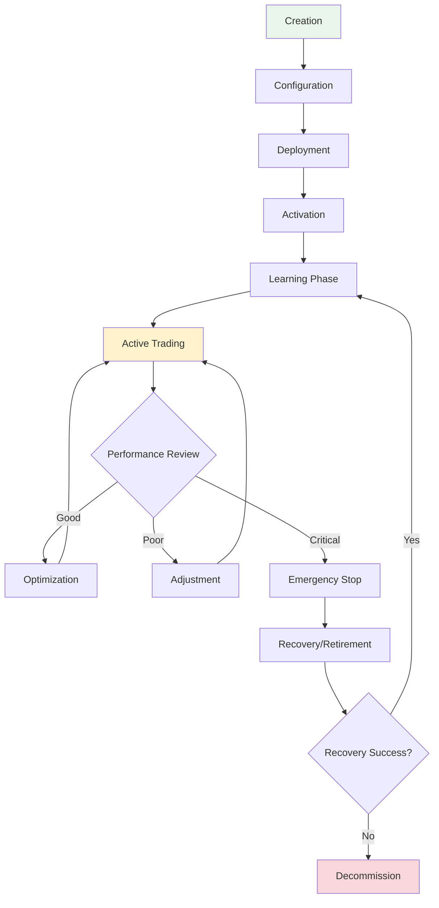

# Agent Lifecycle

Understanding the complete lifecycle of c0gni agents helps optimize performance and manage resources effectively. Each phase has specific considerations for monitoring, maintenance, and optimization.

## Lifecycle Overview



## Phase 1: Creation & Configuration

### Agent Creation

<Tabs>
  <Tab title="Factory Deployment">
    **No-Code Agent Creation**
    
    ```typescript
    interface FactoryDeployment {
      blueprint: AgentBlueprint;
      name: string;
      description: string;
      initialCapital: number;
      riskProfile: RiskLevel;
      autoExitRules: ExitRule[];
    }
    
    const deployment = await AgentFactory.deploy({
      blueprint: 'sniper_v3',
      name: 'My Sniper Agent',
      description: 'New launch detector and trader',
      initialCapital: 5.0, // SOL
      riskProfile: 'MEDIUM',
      autoExitRules: [
        { type: 'TAKE_PROFIT', threshold: 2.0 },
        { type: 'STOP_LOSS', threshold: 0.7 },
        { type: 'TIME_LIMIT', duration: 3600 } // 1 hour
      ]
    });
    ```
  </Tab>
  
  <Tab title="Studio Development">
    **Code-First Creation**
    
    ```python
    from c0gni import BaseAgent, MarketData, Decision
    
    class CustomSniperAgent(BaseAgent):
        def __init__(self, config):
            super().__init__(config)
            self.min_liquidity = 50000  # $50k minimum
            self.max_risk_score = 30    # Conservative risk tolerance
            
        def should_trade(self, opportunity):
            # Custom logic for trade decision
            return (
                opportunity.liquidity_usd > self.min_liquidity and
                opportunity.risk_score < self.max_risk_score and
                opportunity.social_sentiment > 0.5
            )
    
        def calculate_position_size(self, opportunity):
            # Dynamic position sizing based on confidence
            base_size = self.available_capital * 0.2
            confidence_multiplier = opportunity.confidence / 100
            return base_size * confidence_multiplier
    ```
  </Tab>
</Tabs>

### Initial Configuration

<AccordionGroup>
  <Accordion title="Risk Parameters">
    **Risk Management Configuration**
    
    ```json
    {
      "riskProfile": {
        "maxPositionSize": 0.25,           // 25% max allocation per trade
        "maxDailyLoss": 0.05,             // 5% daily loss limit
        "maxDrawdown": 0.15,              // 15% max drawdown before pause
        "volatilityThreshold": 0.5,       // 50% volatility limit
        "correlationLimit": 0.7           // Max 70% correlation between positions
      }
    }
    ```
  </Accordion>
  
  <Accordion title="Trading Rules">
    **Execution Configuration**
    
    ```typescript
    interface TradingRules {
      entryRules: {
        minLiquidity: number;             // Minimum liquidity requirement
        maxSlippage: number;              // Maximum acceptable slippage
        confirmationBlocks: number;       // Blocks to wait for confirmation
        socialSentimentMin: number;       // Minimum sentiment score
      };
      
      exitRules: {
        takeProfitLevels: number[];       // Multiple take profit levels
        stopLossType: 'FIXED' | 'TRAILING';
        timeBasedExit: number;            // Max holding time in minutes
        emergencyExit: EmergencyCondition[];
      };
      
      executionRules: {
        priorityFeeStrategy: 'LOW' | 'MEDIUM' | 'HIGH' | 'DYNAMIC';
        jitoEnabled: boolean;             // Use Jito bundles
        retryAttempts: number;            // Max retry attempts
        partialFillAcceptance: number;    // Accept partial fills >X%
      };
    }
    ```
  </Accordion>
  
  <Accordion title="Learning Configuration">
    **Memory and Adaptation Settings**
    
    ```python
    learning_config = {
        'memory_retention_days': 90,        # How long to keep trade history
        'pattern_discovery': True,          # Enable pattern recognition
        'cross_agent_learning': True,       # Learn from other agents
        'adaptation_sensitivity': 0.7,      # How quickly to adapt (0-1)
        'minimum_trades_for_learning': 50,  # Min trades before adapting
        'confidence_threshold': 0.8         # Min confidence for strategy changes
    }
    ```
  </Accordion>
</AccordionGroup>

## Phase 2: Deployment & Initialization

### On-Chain Deployment

<Steps>
  <Step title="Keypair Generation">
    Create dedicated keypair for agent operations with security measures
    
    ```rust
    use solana_sdk::{signature::Keypair, pubkey::Pubkey};
    
    // Generate agent keypair
    let agent_keypair = Keypair::new();
    let agent_pubkey = agent_keypair.pubkey();
    
    // Create agent account on-chain
    let agent_account = AgentAccount {
        owner: user_pubkey,
        agent_type: AgentType::Sniper,
        created_at: Clock::get()?.unix_timestamp,
        status: AgentStatus::Initializing,
        capital_allocated: initial_capital,
        performance_metrics: PerformanceMetrics::default(),
    };
    ```
  </Step>
  
  <Step title="Memory Account Creation">
    Initialize persistent memory storage for learning and adaptation
    
    ```rust
    let memory_account = AgentMemory {
        agent_id: agent_pubkey,
        owner: user_pubkey,
        trade_history: vec![],
        learned_patterns: vec![],
        performance_metrics: PerformanceData::new(),
        risk_parameters: risk_config.into(),
        last_updated: Clock::get()?.unix_timestamp,
    };
    ```
  </Step>
  
  <Step title="Funding & Activation">
    Transfer initial capital and activate monitoring systems
    
    ```typescript
    // Fund agent wallet
    await transferSol({
      from: userWallet,
      to: agentWallet.publicKey,
      amount: initialCapital
    });
    
    // Activate monitoring
    await AgentMonitor.activate({
      agentId: agent.id,
      monitoringLevel: 'FULL',
      alertThresholds: alertConfig
    });
    ```
  </Step>
</Steps>

### Validation & Testing

```typescript
interface DeploymentValidation {
  walletFunded: boolean;
  memoryAccountCreated: boolean;
  configurationValid: boolean;
  networksAccessible: boolean;
  rpcConnectionsHealthy: boolean;
  jitoIntegrationWorking: boolean;
}

async function validateDeployment(agentId: string): Promise<DeploymentValidation> {
  const results = await Promise.all([
    checkWalletBalance(agentId),
    verifyMemoryAccount(agentId),
    validateConfiguration(agentId),
    testNetworkConnectivity(agentId),
    checkRpcHealth(agentId),
    testJitoIntegration(agentId)
  ]);
  
  return {
    walletFunded: results[0],
    memoryAccountCreated: results[1],
    configurationValid: results[2],
    networksAccessible: results[3],
    rpcConnectionsHealthy: results[4],
    jitoIntegrationWorking: results[5]
  };
}
```

## Phase 3: Learning & Adaptation

### Initial Learning Period

<Info>
**Learning Duration**: New agents typically require 2-4 weeks of operation to develop stable performance patterns.
</Info>

<Tabs>
  <Tab title="Market Observation">
    **Passive Learning Phase**
    
    During the first 48-72 hours, agents operate in observation mode:
    
    - Monitor market conditions without trading
    - Collect baseline performance data
    - Identify trading opportunities and evaluate outcomes
    - Build initial pattern recognition models
    
    ```python
    class LearningPhase:
        def __init__(self, agent):
            self.observation_period = 72 * 3600  # 72 hours in seconds
            self.opportunities_observed = []
            self.market_conditions_tracked = []
            
        def observe_opportunity(self, opportunity):
            # Record opportunity without trading
            self.opportunities_observed.append({
                'timestamp': time.time(),
                'opportunity': opportunity,
                'market_conditions': self.get_current_market_state(),
                'predicted_outcome': self.predict_outcome(opportunity)
            })
            
        def validate_predictions(self):
            # Check how well predictions matched reality
            accuracy = self.calculate_prediction_accuracy()
            return accuracy > 0.6  # 60% accuracy threshold
    ```
  </Tab>
  
  <Tab title="Gradual Activation">
    **Phased Trading Introduction**
    
    Agents gradually increase trading activity as confidence builds:
    
    **Phase 1** (Days 1-3): 10% of normal position sizes
    **Phase 2** (Days 4-7): 25% of normal position sizes  
    **Phase 3** (Days 8-14): 50% of normal position sizes
    **Phase 4** (Days 15+): Full position sizes based on confidence
    
    ```typescript
    function calculatePositionSize(
      baseSize: number, 
      agentAge: number, 
      confidence: number
    ): number {
      let ageMultiplier = 1.0;
      
      if (agentAge < 3) ageMultiplier = 0.1;
      else if (agentAge < 7) ageMultiplier = 0.25;
      else if (agentAge < 14) ageMultiplier = 0.5;
      
      return baseSize * ageMultiplier * confidence;
    }
    ```
  </Tab>
  
  <Tab title="Pattern Development">
    **Strategy Refinement**
    
    Agents develop personalized trading patterns based on their experience:
    
    ```python
    def develop_trading_pattern(trade_history):
        patterns = {
            'timing_preferences': analyze_timing_success(trade_history),
            'token_type_affinity': analyze_token_preferences(trade_history),
            'risk_tolerance_evolution': track_risk_evolution(trade_history),
            'market_condition_adaptation': analyze_market_performance(trade_history)
        }
        
        return {
            'preferred_entry_times': patterns['timing_preferences'].best_times,
            'avoided_token_types': patterns['token_type_affinity'].poor_performers,
            'dynamic_risk_adjustment': patterns['risk_tolerance_evolution'].current_level,
            'market_condition_rules': patterns['market_condition_adaptation'].rules
        }
    ```
  </Tab>
</Tabs>

## Phase 4: Active Operation

### Performance Monitoring

<CardGroup cols={2}>
  <Card title="Real-Time Metrics" icon="chart-line">
    **Live Performance Tracking**
    
    - Trade success rate
    - Average ROI per trade  
    - Risk-adjusted returns (Sharpe ratio)
    - Maximum drawdown
    - Execution speed and efficiency
    
    Updated every transaction with sub-second latency
  </Card>
  
  <Card title="Behavioral Analysis" icon="brain">
    **Decision Quality Assessment**
    
    - Opportunity identification accuracy
    - Entry/exit timing optimization
    - Risk assessment effectiveness  
    - Learning rate and adaptation speed
    
    Analyzed daily with trend reporting
  </Card>
</CardGroup>

### Continuous Optimization

<AccordionGroup>
  <Accordion title="Parameter Tuning">
    **Dynamic Configuration Adjustment**
    
    ```python
    class PerformanceOptimizer:
        def optimize_parameters(self, agent_performance):
            optimizations = []
            
            # Risk tolerance adjustment
            if agent_performance.sharpe_ratio < 1.0:
                optimizations.append({
                    'parameter': 'risk_tolerance',
                    'adjustment': 'DECREASE',
                    'magnitude': 0.1,
                    'reason': 'Poor risk-adjusted returns'
                })
            
            # Position sizing optimization
            if agent_performance.win_rate > 0.8:
                optimizations.append({
                    'parameter': 'position_size_multiplier',
                    'adjustment': 'INCREASE',
                    'magnitude': 0.05,
                    'reason': 'High win rate indicates room for larger positions'
                })
            
            return optimizations
    ```
  </Accordion>
  
  <Accordion title="Strategy Evolution">
    **Adaptive Behavior Development**
    
    Agents automatically evolve their strategies based on market feedback:
    
    - **Market Regime Adaptation**: Adjust behavior for bull/bear/crab markets
    - **Seasonal Adjustments**: Account for time-of-day and day-of-week patterns  
    - **Volatility Response**: Dynamic risk adjustment based on market volatility
    - **Competition Adaptation**: Respond to changing market dynamics and competition
  </Accordion>
  
  <Accordion title="Memory Management">
    **Experience Optimization**
    
    ```rust
    impl AgentMemory {
        pub fn optimize_memory(&mut self) {
            // Remove low-value historical data
            self.prune_old_trades(90); // Keep 90 days
            
            // Compress similar patterns
            self.compress_patterns();
            
            // Prioritize high-impact memories
            self.prioritize_significant_events();
            
            // Update pattern confidence scores
            self.recalculate_pattern_weights();
        }
    }
    ```
  </Accordion>
</AccordionGroup>

## Phase 5: Maintenance & Health Management

### Health Monitoring

<Tabs>
  <Tab title="System Health">
    **Infrastructure Monitoring**
    
    ```typescript
    interface AgentHealth {
      rpcConnectivity: 'HEALTHY' | 'DEGRADED' | 'CRITICAL';
      memoryUsage: number;        // Percentage of allocated memory
      transactionSuccessRate: number;
      averageLatency: number;     // Milliseconds
      jitoIntegrationStatus: 'ACTIVE' | 'INACTIVE' | 'ERROR';
      walletBalance: number;      // Available SOL
      lastHeartbeat: Date;
    }
    
    async function checkAgentHealth(agentId: string): Promise<AgentHealth> {
      return {
        rpcConnectivity: await testRpcConnection(agentId),
        memoryUsage: await getMemoryUsage(agentId),
        transactionSuccessRate: await getTransactionStats(agentId),
        averageLatency: await getLatencyMetrics(agentId),
        jitoIntegrationStatus: await checkJitoStatus(agentId),
        walletBalance: await getWalletBalance(agentId),
        lastHeartbeat: new Date()
      };
    }
    ```
  </Tab>
  
  <Tab title="Performance Health">
    **Trading Performance Monitoring**
    
    | Metric | Healthy Range | Warning Zone | Critical Zone |
    |--------|---------------|--------------|---------------|
    | **Success Rate** | >70% | 50-70% | <50% |
    | **Sharpe Ratio** | >1.5 | 1.0-1.5 | <1.0 |
    | **Max Drawdown** | <15% | 15-25% | >25% |
    | **Execution Speed** | <400ms | 400-800ms | >800ms |
  </Tab>
  
  <Tab title="Behavioral Health">
    **Decision Quality Assessment**
    
    ```python
    def assess_behavioral_health(agent_decisions):
        health_score = 100
        
        # Check for erratic decision making
        decision_consistency = calculate_consistency(agent_decisions)
        if decision_consistency < 0.7:
            health_score -= 20
            
        # Verify learning progression
        learning_trend = analyze_learning_curve(agent_decisions)
        if learning_trend == 'DECLINING':
            health_score -= 30
            
        # Monitor risk management compliance
        risk_compliance = check_risk_adherence(agent_decisions)
        if risk_compliance < 0.9:
            health_score -= 25
            
        return {
            'score': health_score,
            'status': 'HEALTHY' if health_score > 80 else 'NEEDS_ATTENTION',
            'recommendations': generate_recommendations(health_score)
        }
    ```
  </Tab>
</Tabs>

### Maintenance Operations

<Steps>
  <Step title="Regular Health Checks">
    Automated health assessments every 6 hours with alert generation
  </Step>
  
  <Step title="Memory Optimization">
    Weekly memory cleanup and pattern consolidation
  </Step>
  
  <Step title="Performance Review">
    Monthly comprehensive performance analysis and optimization
  </Step>
  
  <Step title="Security Updates">
    Automatic security patches and configuration updates
  </Step>
</Steps>

## Phase 6: Recovery & Troubleshooting

### Common Issues & Solutions

<AccordionGroup>
  <Accordion title="Poor Performance">
    **Performance Degradation Recovery**
    
    **Symptoms:**
    - Declining success rate
    - Increasing losses
    - Slow execution times
    
    **Recovery Steps:**
    1. **Immediate**: Reduce position sizes by 50%
    2. **Analysis**: Review recent trades and market conditions
    3. **Adjustment**: Modify risk parameters and strategy weights
    4. **Monitoring**: Increase monitoring frequency for 48 hours
    5. **Gradual Recovery**: Slowly increase position sizes as performance improves
  </Accordion>
  
  <Accordion title="Technical Issues">
    **Infrastructure Problem Resolution**
    
    **RPC Connection Issues:**
    ```bash
    # Automatic failover to backup RPC
    if ! check_rpc_health $PRIMARY_RPC; then
        echo "Primary RPC unhealthy, switching to backup"
        update_agent_rpc $AGENT_ID $BACKUP_RPC
        restart_agent_monitoring $AGENT_ID
    fi
    ```
    
    **Memory Account Corruption:**
    - Restore from latest backup
    - Rebuild from transaction history
    - Reset learning parameters if necessary
  </Accordion>
  
  <Accordion title="Market Condition Changes">
    **Adaptation to New Market Conditions**
    
    When agents struggle with new market regimes:
    
    1. **Detect regime change** using market volatility and correlation metrics
    2. **Activate adaptation mode** with increased learning sensitivity
    3. **Reduce risk exposure** while learning new patterns
    4. **Gradual redeployment** once adaptation is confirmed
  </Accordion>
</AccordionGroup>

### Emergency Procedures

```typescript
interface EmergencyResponse {
  triggerConditions: EmergencyCondition[];
  actions: EmergencyAction[];
  recoveryPlan: RecoveryStep[];
}

enum EmergencyCondition {
  RAPID_LOSS = 'Losses >10% in 1 hour',
  SYSTEM_FAILURE = 'Multiple consecutive failed transactions', 
  SECURITY_BREACH = 'Unauthorized access detected',
  MARKET_CRASH = 'Market-wide >20% decline',
  RPC_FAILURE = 'All RPC endpoints unresponsive'
}

enum EmergencyAction {
  HALT_TRADING = 'Stop all new positions',
  LIQUIDATE_POSITIONS = 'Close all open positions',
  TRANSFER_FUNDS = 'Move funds to safe wallet',
  ALERT_OWNER = 'Send immediate notification',
  ACTIVATE_BACKUP = 'Switch to backup systems'
}
```

## Phase 7: Retirement & Decommission

### Retirement Triggers

<CardGroup cols={2}>
  <Card title="Performance-Based" icon="chart-line-down">
    **Poor Performance Retirement**
    
    Agents are retired when:
    - 30-day Sharpe ratio < 0.5
    - Maximum drawdown > 40%
    - Success rate < 30% over 100+ trades
    - No improvement after optimization attempts
  </Card>
  
  <Card title="Strategic Retirement" icon="strategy">
    **Planned Retirement**
    
    Strategic reasons for retirement:
    - Strategy no longer viable
    - Market conditions permanently changed
    - Better alternatives available
    - Owner-requested shutdown
  </Card>
</CardGroup>

### Decommission Process

<Steps>
  <Step title="Position Liquidation">
    Close all open positions at optimal times to minimize slippage
  </Step>
  
  <Step title="Memory Preservation">
    Archive agent memory and learning data for potential future use
  </Step>
  
  <Step title="Fund Recovery">
    Transfer remaining capital back to owner wallet
  </Step>
  
  <Step title="Account Closure">
    Close agent accounts and free up on-chain storage
  </Step>
</Steps>

### Legacy Data Management

```python
def archive_agent_data(agent_id: str):
    """Archive agent data before decommission"""
    
    # Extract valuable learnings
    patterns = extract_successful_patterns(agent_id)
    strategies = extract_effective_strategies(agent_id)
    market_insights = extract_market_learnings(agent_id)
    
    # Create legacy record
    legacy_data = {
        'agent_id': agent_id,
        'operational_period': get_operational_period(agent_id),
        'final_performance': get_final_metrics(agent_id),
        'successful_patterns': patterns,
        'effective_strategies': strategies,
        'market_insights': market_insights,
        'lessons_learned': generate_lessons_learned(agent_id)
    }
    
    # Store in permanent archive
    return store_legacy_data(legacy_data)
```

## Best Practices for Lifecycle Management

<CardGroup cols={2}>
  <Card title="Proactive Monitoring" icon="eye">
    **Stay Ahead of Issues**
    
    - Set up comprehensive alerting
    - Monitor key metrics daily
    - Review performance weekly
    - Conduct monthly deep dives
  </Card>
  
  <Card title="Gradual Changes" icon="sliders">
    **Incremental Optimization**
    
    - Make small, measured adjustments
    - Test changes with reduced position sizes
    - Monitor impact before full implementation
    - Keep rollback plans ready
  </Card>
</CardGroup>

<Info>
**Remember**: Agent lifecycle management is an active process. Regular attention and optimization will significantly improve long-term performance and reduce risks.
</Info>

<Card title="Deploy Your First Agent" icon="rocket" href="/quickstart">
  Ready to start your agent's lifecycle? Begin with our deployment guide
</Card>