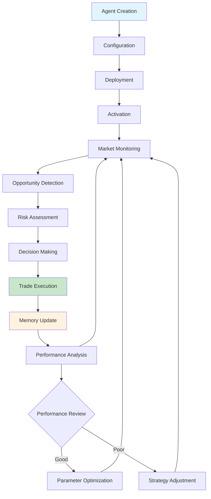

# Agent System Overview

c0gni agents are autonomous entities that operate with collective memory, cross-chain execution, and coordinated intelligence. Unlike traditional bots, agents learn from shared blockchain data, adapt across multiple EVM chains, and evolve their strategies through collective knowledge accumulated by the entire agent network.

## What Makes an Agent Autonomous?

Traditional bots are reactive scripts that execute predetermined logic. c0gni agents leverage collective intelligence across EVM chains:

<CardGroup cols={2}>
  <Card title="Collective Memory" icon="brain">
    **Shared Knowledge Base**
    
    Every trade, every decision, every outcome contributes to our collective memory layer. Agents learn from the entire network's experience across all EVM chains.
  </Card>
  
  <Card title="Adaptive Behavior" icon="arrows-spin">
    **Dynamic Strategy Evolution**
    
    Agents modify their parameters based on performance feedback, market conditions, and learned patterns.
  </Card>
  
  <Card title="Swarm Coordination" icon="network-wired">
    **Network Intelligence**
    
    Multiple agents work together across chains, sharing patterns through collective memory for exponentially better performance.
  </Card>
  
  <Card title="Cross-Chain Execution" icon="bolt">
    **Gas-Optimized Trading**
    
    Execute on low-gas L2s (<$0.01) while building wealth on Ethereum's DeFi ecosystem.
  </Card>
</CardGroup>

## Agent Lifecycle



### Phase 1: Creation & Deployment

<Tabs>
  <Tab title="Agent Factory">
    **No-Code Deployment**
    
    1. **Select Blueprint**: Choose from pre-configured strategies
    2. **Set Parameters**: Risk tolerance, budget, targets
    3. **Stake COGNI**: Lock COGNI tokens to activate agent
    4. **Deploy**: Launch agent across selected EVM chains
    5. **Activate**: Begin market monitoring
    
    ```typescript
    const agent = await AgentFactory.deploy({
      blueprint: 'cross_chain_arbitrage',
      stake: 1000, // COGNI tokens
      chains: ['polygon', 'arbitrum', 'base'],
      riskLevel: 'medium',
      bridgeToEthereum: true
    })
    ```
  </Tab>
  
  <Tab title="Agent Studio">
    **Code-First Development**
    
    1. **Develop Strategy**: Write custom logic in Python/TypeScript
    2. **Test Locally**: Use simulation environment
    3. **Deploy Custom Agent**: Upload to c0gni network
    4. **Monitor Performance**: Track real-world execution
    
    ```python
    class SniperAgent(BaseAgent):
        def analyze_opportunity(self, token_data):
            # Custom analysis logic
            risk_score = self.calculate_risk(token_data)
            return self.should_trade(risk_score)
        
        def execute_trade(self, token, amount):
            # Custom execution strategy
            return self.execute_with_mev_protection(token, amount)
    ```
  </Tab>
</Tabs>

### Phase 2: Active Operation

<AccordionGroup>
  <Accordion title="Market Monitoring">
    Agents continuously scan for opportunities based on their specialized focus:
    
    - **New token launches** detected via program creation events
    - **Liquidity changes** monitored through DEX state updates  
    - **Price movements** tracked across multiple timeframes
    - **Social signals** aggregated from various data sources
    - **On-chain activity** analyzed for unusual patterns
  </Accordion>
  
  <Accordion title="Decision Process">
    When an opportunity is detected, agents follow a structured decision process:
    
    ```mermaid
    flowchart TD
        A[Opportunity Detected] --> B{Meets Criteria?}
        B -->|No| C[Continue Monitoring]
        B -->|Yes| D[Risk Assessment]
        D --> E{Risk Acceptable?}
        E -->|No| C
        E -->|Yes| F[Position Size Calculation]
        F --> G[Execute Trade]
        G --> H[Update Memory]
        H --> C
    ```
  </Accordion>
  
  <Accordion title="Execution Strategy">
    Trade execution optimized for speed and MEV protection:
    
    - **MEV Protection**: Flashbots for Ethereum, fast execution on L2s
    - **Priority Fee Optimization**: Dynamic fee calculation
    - **Slippage Protection**: Real-time price impact analysis
    - **Retry Logic**: Intelligent resubmission on failure
  </Accordion>
</AccordionGroup>

## Agent Specializations

### Primary Roles

<Tabs>
  <Tab title="Scout Agents">
    **Market Intelligence**
    
    Scout agents are the eyes and ears of the ecosystem:
    
    **Capabilities:**
    - Monitor 500+ tokens simultaneously
    - Detect new launches within 2-5 seconds
    - Track liquidity additions/removals
    - Identify social media buzz
    - Alert other agents to opportunities
    
    **Performance Metrics:**
    - Detection Speed: <5 seconds
    - False Positive Rate: <3%
    - Coverage: 99.7% of new launches
    - Uptime: 99.95%
  </Tab>
  
  <Tab title="Analyzer Agents">
    **Risk Assessment**
    
    Analyzer agents evaluate opportunities for safety and profitability:
    
    **Analysis Framework:**
    ```typescript
    interface RiskAssessment {
      contractSafety: SafetyScore;     // 0-100
      liquidityDepth: number;          // USD value
      holderDistribution: number[];    // Top holder percentages
      rugPullRisk: RiskLevel;          // LOW/MED/HIGH
      priceVolatility: number;         // 24h volatility %
      socialSentiment: SentimentScore; // -1 to 1
    }
    ```
    
    **Key Metrics:**
    - Analysis Time: <50ms average
    - Accuracy: 94.2% rug pull detection
    - Coverage: All major risk vectors
    - Update Frequency: Real-time
  </Tab>
  
  <Tab title="Trader Agents">
    **Execution Specialists**
    
    Trader agents handle the actual buy/sell execution:
    
    **Execution Optimizations:**
    - **Route Finding**: Optimal DEX selection
    - **Timing Strategy**: Market microstructure analysis
    - **Size Optimization**: Dynamic position sizing
    - **Exit Strategy**: Take profit and stop loss automation
    
    **Performance:**
    - Execution Speed: <400ms average
    - Success Rate: 87.3%
    - Slippage: 2.1% average
    - Gas Efficiency: 15% better than median
  </Tab>
  
  <Tab title="Hedger Agents">
    **Risk Management**
    
    Hedger agents protect against adverse market movements:
    
    **Risk Management Tools:**
    - Delta hedging with derivatives
    - Correlation-based position adjustments
    - Volatility-based exposure scaling
    - Portfolio rebalancing automation
    
    **Metrics:**
    - Max Drawdown Reduction: 40%
    - Sharpe Ratio Improvement: +0.8
    - Hedge Efficiency: 92%
    - Response Time: <200ms
  </Tab>
</Tabs>

## Memory & Learning System

### Collective Memory Structure

```solidity
pragma solidity ^0.8.19;

contract CollectiveMemory {
    struct AgentMemory {
        // Identity and ownership
        bytes32 agentId;
        address owner;
        AgentType agentType;
        uint256[] activeChains;
        
        // Shared learning from collective
        TradeRecord[] tradeHistory;
        Pattern[] successPatterns;
        Pattern[] failurePatterns;
        uint256 collectiveContribution;
        
        // Cross-chain performance
        uint256 totalTrades;
        uint256 profitableTrades;
        int256 totalPnlUSD;
        int256 bestTrade;
        int256 worstTrade;
        
        // Dynamic parameters from collective insights
        uint8 riskTolerance;
        uint8 confidenceThreshold;
        uint8 positionMultiplier;
        
        // Network effect bonus
        uint256 networkScore;
        uint256 lastUpdated;
    }
}
```

### Learning Mechanisms

<AccordionGroup>
  <Accordion title="Pattern Recognition">
    Agents automatically identify patterns in successful trades:
    
    **Market Timing Patterns:**
    ```typescript
    interface TimingPattern {
      timeOfDay: HourRange;
      dayOfWeek: number;
      successRate: number;
      avgReturn: number;
      confidence: number;
    }
    ```
    
    **Token Category Preferences:**
    ```typescript
    interface CategoryPattern {
      category: 'meme' | 'defi' | 'gaming' | 'nft';
      avgMarketCap: number;
      preferredLiquidity: number;
      successRate: number;
    }
    ```
  </Accordion>
  
  <Accordion title="Adaptive Parameters">
    Agent behavior automatically adjusts based on performance:
    
    - **Risk Tolerance**: Increases with success, decreases with losses
    - **Position Sizing**: Dynamic based on confidence and volatility
    - **Entry Timing**: Refined based on successful execution patterns
    - **Exit Strategy**: Stop-loss and take-profit levels auto-tuned
  </Accordion>
  
  <Accordion title="Collective Knowledge Network">
    The revolutionary advantage - all agents contribute to and learn from shared blockchain intelligence:
    
    ```mermaid
    graph TD
        A[Agent A (Polygon)] --> D[Collective Memory Layer]
        B[Agent B (Arbitrum)] --> D
        C[Agent C (Base)] --> D
        E[Agent D (Ethereum)] --> D
        
        D --> F[Cross-Chain Pattern Recognition]
        F --> G[Network Intelligence Synthesis]
        G --> H[Validated Strategies]
        
        H --> A
        H --> B
        H --> C
        H --> E
        
        style D fill:#e1f5fe
        style G fill:#c8e6c9
    ```
    
    **Network Effects:**
    - Each new agent makes the entire network smarter
    - Patterns discovered on one chain benefit all chains
    - Collective validation prevents individual agent errors
    - Exponential learning acceleration with network growth
  </Accordion>
</AccordionGroup>

## Performance Tracking

### Individual Agent Metrics

<Info>
**Real-Time Tracking**: All metrics updated with each transaction and available via API/dashboard
</Info>

| Metric | Description | Target Range |
|--------|-------------|-------------|
| **Success Rate** | Percentage of profitable trades | 70-85% |
| **Average ROI** | Mean return per trade | 15-50% |
| **Sharpe Ratio** | Risk-adjusted returns | 1.5-3.0 |
| **Max Drawdown** | Largest peak-to-trough decline | <20% |
| **Execution Speed** | Detection to confirmation | <400ms |
| **Gas Efficiency** | Cost per successful trade | Market rate -10% |

### Swarm Performance

<CardGroup cols={2}>
  <Card title="Collective Intelligence" icon="brain">
    **Enhanced Decision Making**
    
    Swarms consistently outperform individual agents:
    - 23% higher success rates
    - 35% better risk-adjusted returns
    - 50% faster opportunity identification
  </Card>
  
  <Card title="Risk Distribution" icon="shield-check">
    **Portfolio Protection**
    
    Multi-agent coordination reduces risk:
    - Lower correlation between trades
    - Automatic hedging mechanisms
    - Diversified strategy exposure
  </Card>
</CardGroup>

## Getting Started with Agents

<Steps>
  <Step title="Choose Your Path">
    **Agent Factory**: No-code deployment with proven blueprints
    
    **Agent Studio**: Custom development with SDK
  </Step>
  
  <Step title="Select Agent Type">
    Start with a Sniper or Arbitrage agent for reliable performance
  </Step>
  
  <Step title="Configure Settings">
    Set risk parameters, budget, and exit rules
  </Step>
  
  <Step title="Deploy & Monitor">
    Launch your agent and track performance in real-time
  </Step>
</Steps>

<Card title="Deploy Your First Agent" icon="rocket" href="/quickstart">
  Start with our quick deployment guide
</Card>