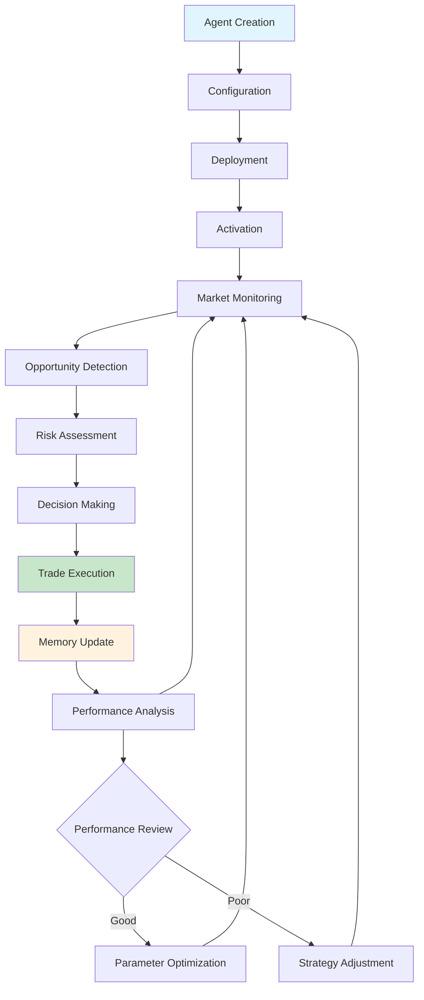

# Agent System Overview

c0gni agents are autonomous entities that operate with persistent memory, machine-speed execution, and coordinated intelligence. Unlike traditional bots, agents learn, adapt, and evolve their strategies based on market conditions and performance feedback.

## What Makes an Agent Autonomous?

Traditional bots are reactive scripts that execute predetermined logic. c0gni agents are fundamentally different:

<CardGroup cols={2}>
  <Card title="Persistent Memory" icon="brain">
    **On-Chain Learning**
    
    Every trade, every decision, every outcome is permanently stored on Solana. Agents build experience that influences future decisions.
  </Card>
  
  <Card title="Adaptive Behavior" icon="arrows-spin">
    **Dynamic Strategy Evolution**
    
    Agents modify their parameters based on performance feedback, market conditions, and learned patterns.
  </Card>
  
  <Card title="Swarm Coordination" icon="network-wired">
    **Collective Intelligence**
    
    Multiple agents work together, sharing information and coordinating actions for compound performance.
  </Card>
  
  <Card title="Real-Time Execution" icon="bolt">
    **Sub-400ms Response**
    
    From opportunity detection to on-chain execution in less than human reaction time.
  </Card>
</CardGroup>

## Agent Lifecycle



### Phase 1: Creation & Deployment

<Tabs>
  <Tab title="Agent Factory">
    **No-Code Deployment**
    
    1. **Select Blueprint**: Choose from pre-configured strategies
    2. **Set Parameters**: Risk tolerance, budget, targets
    3. **Fund Wallet**: Transfer SOL to agent's dedicated wallet
    4. **Deploy**: Create agent program on Solana
    5. **Activate**: Begin market monitoring
    
    ```typescript
    const agent = await AgentFactory.deploy({
      blueprint: 'sniper_v2',
      budget: 5.0, // SOL
      riskLevel: 'medium',
      autoExit: true
    })
    ```
  </Tab>
  
  <Tab title="Agent Studio">
    **Code-First Development**
    
    1. **Develop Strategy**: Write custom logic in Python/TypeScript
    2. **Test Locally**: Use simulation environment
    3. **Deploy Custom Agent**: Upload to c0gni network
    4. **Monitor Performance**: Track real-world execution
    
    ```python
    class SniperAgent(BaseAgent):
        def analyze_opportunity(self, token_data):
            # Custom analysis logic
            risk_score = self.calculate_risk(token_data)
            return self.should_trade(risk_score)
        
        def execute_trade(self, token, amount):
            # Custom execution strategy
            return self.submit_jito_bundle(token, amount)
    ```
  </Tab>
</Tabs>

### Phase 2: Active Operation

<AccordionGroup>
  <Accordion title="Market Monitoring">
    Agents continuously scan for opportunities based on their specialized focus:
    
    - **New token launches** detected via program creation events
    - **Liquidity changes** monitored through DEX state updates  
    - **Price movements** tracked across multiple timeframes
    - **Social signals** aggregated from various data sources
    - **On-chain activity** analyzed for unusual patterns
  </Accordion>
  
  <Accordion title="Decision Process">
    When an opportunity is detected, agents follow a structured decision process:
    
    ```mermaid
    flowchart TD
        A[Opportunity Detected] --> B{Meets Criteria?}
        B -->|No| C[Continue Monitoring]
        B -->|Yes| D[Risk Assessment]
        D --> E{Risk Acceptable?}
        E -->|No| C
        E -->|Yes| F[Position Size Calculation]
        F --> G[Execute Trade]
        G --> H[Update Memory]
        H --> C
    ```
  </Accordion>
  
  <Accordion title="Execution Strategy">
    Trade execution optimized for speed and MEV protection:
    
    - **Jito Bundle Preparation**: Private mempool submission
    - **Priority Fee Optimization**: Dynamic fee calculation
    - **Slippage Protection**: Real-time price impact analysis
    - **Retry Logic**: Intelligent resubmission on failure
  </Accordion>
</AccordionGroup>

## Agent Specializations

### Primary Roles

<Tabs>
  <Tab title="Scout Agents">
    **Market Intelligence**
    
    Scout agents are the eyes and ears of the ecosystem:
    
    **Capabilities:**
    - Monitor 500+ tokens simultaneously
    - Detect new launches within 2-5 seconds
    - Track liquidity additions/removals
    - Identify social media buzz
    - Alert other agents to opportunities
    
    **Performance Metrics:**
    - Detection Speed: <5 seconds
    - False Positive Rate: <3%
    - Coverage: 99.7% of new launches
    - Uptime: 99.95%
  </Tab>
  
  <Tab title="Analyzer Agents">
    **Risk Assessment**
    
    Analyzer agents evaluate opportunities for safety and profitability:
    
    **Analysis Framework:**
    ```typescript
    interface RiskAssessment {
      contractSafety: SafetyScore;     // 0-100
      liquidityDepth: number;          // USD value
      holderDistribution: number[];    // Top holder percentages
      rugPullRisk: RiskLevel;          // LOW/MED/HIGH
      priceVolatility: number;         // 24h volatility %
      socialSentiment: SentimentScore; // -1 to 1
    }
    ```
    
    **Key Metrics:**
    - Analysis Time: <50ms average
    - Accuracy: 94.2% rug pull detection
    - Coverage: All major risk vectors
    - Update Frequency: Real-time
  </Tab>
  
  <Tab title="Trader Agents">
    **Execution Specialists**
    
    Trader agents handle the actual buy/sell execution:
    
    **Execution Optimizations:**
    - **Route Finding**: Optimal DEX selection
    - **Timing Strategy**: Market microstructure analysis
    - **Size Optimization**: Dynamic position sizing
    - **Exit Strategy**: Take profit and stop loss automation
    
    **Performance:**
    - Execution Speed: <400ms average
    - Success Rate: 87.3%
    - Slippage: 2.1% average
    - Gas Efficiency: 15% better than median
  </Tab>
  
  <Tab title="Hedger Agents">
    **Risk Management**
    
    Hedger agents protect against adverse market movements:
    
    **Risk Management Tools:**
    - Delta hedging with derivatives
    - Correlation-based position adjustments
    - Volatility-based exposure scaling
    - Portfolio rebalancing automation
    
    **Metrics:**
    - Max Drawdown Reduction: 40%
    - Sharpe Ratio Improvement: +0.8
    - Hedge Efficiency: 92%
    - Response Time: <200ms
  </Tab>
</Tabs>

## Memory & Learning System

### On-Chain Memory Structure

```rust
#[account]
pub struct AgentMemory {
    // Identity and ownership
    pub agent_id: Pubkey,
    pub owner: Pubkey,
    pub agent_type: AgentType,
    
    // Trade history for learning
    pub trade_history: Vec<TradeRecord>,
    pub success_patterns: Vec<SuccessPattern>,
    pub failure_patterns: Vec<FailurePattern>,
    
    // Performance tracking
    pub total_trades: u64,
    pub profitable_trades: u64,
    pub total_pnl: i64, // in lamports
    pub best_trade: i64,
    pub worst_trade: i64,
    
    // Learning parameters
    pub risk_tolerance: u8,
    pub confidence_threshold: u8,
    pub position_size_multiplier: u8,
    
    // Metadata
    pub last_updated: i64,
    pub version: u8,
}
```

### Learning Mechanisms

<AccordionGroup>
  <Accordion title="Pattern Recognition">
    Agents automatically identify patterns in successful trades:
    
    **Market Timing Patterns:**
    ```typescript
    interface TimingPattern {
      timeOfDay: HourRange;
      dayOfWeek: number;
      successRate: number;
      avgReturn: number;
      confidence: number;
    }
    ```
    
    **Token Category Preferences:**
    ```typescript
    interface CategoryPattern {
      category: 'meme' | 'defi' | 'gaming' | 'nft';
      avgMarketCap: number;
      preferredLiquidity: number;
      successRate: number;
    }
    ```
  </Accordion>
  
  <Accordion title="Adaptive Parameters">
    Agent behavior automatically adjusts based on performance:
    
    - **Risk Tolerance**: Increases with success, decreases with losses
    - **Position Sizing**: Dynamic based on confidence and volatility
    - **Entry Timing**: Refined based on successful execution patterns
    - **Exit Strategy**: Stop-loss and take-profit levels auto-tuned
  </Accordion>
  
  <Accordion title="Knowledge Sharing">
    Agents can learn from swarm collective memory:
    
    ```mermaid
    graph TD
        A[Agent A Experience] --> D[Swarm Memory Pool]
        B[Agent B Experience] --> D
        C[Agent C Experience] --> D
        
        D --> E[Pattern Aggregation]
        E --> F[Consensus Formation]
        F --> G[Knowledge Distribution]
        
        G --> A
        G --> B
        G --> C
    ```
  </Accordion>
</AccordionGroup>

## Performance Tracking

### Individual Agent Metrics

<Info>
**Real-Time Tracking**: All metrics updated with each transaction and available via API/dashboard
</Info>

| Metric | Description | Target Range |
|--------|-------------|-------------|
| **Success Rate** | Percentage of profitable trades | 70-85% |
| **Average ROI** | Mean return per trade | 15-50% |
| **Sharpe Ratio** | Risk-adjusted returns | 1.5-3.0 |
| **Max Drawdown** | Largest peak-to-trough decline | <20% |
| **Execution Speed** | Detection to confirmation | <400ms |
| **Gas Efficiency** | Cost per successful trade | Market rate -10% |

### Swarm Performance

<CardGroup cols={2}>
  <Card title="Collective Intelligence" icon="brain">
    **Enhanced Decision Making**
    
    Swarms consistently outperform individual agents:
    - 23% higher success rates
    - 35% better risk-adjusted returns
    - 50% faster opportunity identification
  </Card>
  
  <Card title="Risk Distribution" icon="shield-check">
    **Portfolio Protection**
    
    Multi-agent coordination reduces risk:
    - Lower correlation between trades
    - Automatic hedging mechanisms
    - Diversified strategy exposure
  </Card>
</CardGroup>

## Getting Started with Agents

<Steps>
  <Step title="Choose Your Path">
    **Agent Factory**: No-code deployment with proven blueprints
    
    **Agent Studio**: Custom development with SDK
  </Step>
  
  <Step title="Select Agent Type">
    Start with a Sniper or Arbitrage agent for reliable performance
  </Step>
  
  <Step title="Configure Settings">
    Set risk parameters, budget, and exit rules
  </Step>
  
  <Step title="Deploy & Monitor">
    Launch your agent and track performance in real-time
  </Step>
</Steps>

<Card title="Deploy Your First Agent" icon="rocket" href="/quickstart">
  Start with our quick deployment guide
</Card>