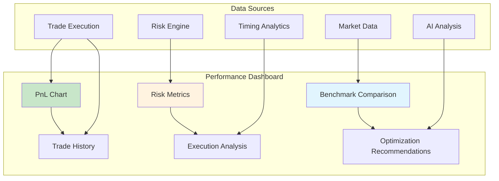

# Agent Performance

Performance measurement and optimization are critical for successful autonomous trading. c0gni provides comprehensive analytics and tools to maximize agent effectiveness and profitability.

<Info>
**Live Performance Data**: All metrics are updated in real-time and accessible via the dashboard, API, and WebSocket feeds.
</Info>

## Key Performance Metrics

### Primary Performance Indicators

<CardGroup cols={2}>
  <Card title="Success Rate" icon="target">
    **Percentage of Profitable Trades**
    
    ```
    Success Rate = Profitable Trades / Total Trades × 100
    ```
    
    - **Excellent**: >80%
    - **Good**: 70-80%
    - **Average**: 60-70%
    - **Poor**: <60%
  </Card>
  
  <Card title="Return on Investment (ROI)" icon="trending-up">
    **Average Return Per Trade**
    
    ```
    ROI = (Exit Price - Entry Price) / Entry Price × 100
    ```
    
    - **Excellent**: >100%
    - **Good**: 50-100%
    - **Average**: 20-50%
    - **Poor**: <20%
  </Card>
  
  <Card title="Sharpe Ratio" icon="chart-line">
    **Risk-Adjusted Returns**
    
    ```
    Sharpe = (Portfolio Return - Risk-Free Rate) / Portfolio Volatility
    ```
    
    - **Excellent**: >2.0
    - **Good**: 1.5-2.0
    - **Average**: 1.0-1.5
    - **Poor**: <1.0
  </Card>
  
  <Card title="Maximum Drawdown" icon="arrow-trend-down">
    **Largest Peak-to-Trough Decline**
    
    ```
    Max Drawdown = (Trough Value - Peak Value) / Peak Value × 100
    ```
    
    - **Excellent**: <10%
    - **Good**: 10-15%
    - **Average**: 15-25%
    - **Poor**: >25%
  </Card>
</CardGroup>

## Performance Dashboard

### Real-Time Performance Tracking

<Tabs>
  <Tab title="Live Metrics">
    **Current Performance Overview**
    
    ```typescript
    interface LiveMetrics {
      currentPnL: number;           // Real-time profit/loss
      dailyReturn: number;          // Today's performance
      weeklyReturn: number;         // 7-day performance  
      monthlyReturn: number;        // 30-day performance
      activePositions: number;      // Current open trades
      successRateToday: number;     // Today's win rate
      averageTradeTime: number;     // Avg holding period (minutes)
      executionSpeed: number;       // Avg execution time (ms)
    }
    
    // Example real-time data
    const currentMetrics: LiveMetrics = {
      currentPnL: 234,             // +$234 USD
      dailyReturn: 0.078,          // +7.8%
      weeklyReturn: 0.234,         // +23.4%
      monthlyReturn: 1.456,        // +145.6%
      activePositions: 3,
      successRateToday: 0.83,      // 83%
      averageTradeTime: 12.5,      // 12.5 minutes
      executionSpeed: 287          // 287ms
    };
    ```
  </Tab>
  
  <Tab title="Historical Analysis">
    **Performance Trends Over Time**
    
    ```python
    def analyze_performance_trends(agent_data, timeframe_days=30):
        """Analyze agent performance trends"""
        
        trends = {
            'success_rate_trend': calculate_trend(agent_data.success_rates),
            'roi_trend': calculate_trend(agent_data.roi_values), 
            'risk_trend': calculate_trend(agent_data.risk_metrics),
            'execution_speed_trend': calculate_trend(agent_data.execution_times)
        }
        
        # Identify patterns
        patterns = {
            'time_of_day_performance': analyze_hourly_performance(agent_data),
            'day_of_week_patterns': analyze_daily_patterns(agent_data),
            'market_condition_performance': analyze_market_conditions(agent_data),
            'token_type_preferences': analyze_token_performance(agent_data)
        }
        
        return {
            'trends': trends,
            'patterns': patterns,
            'recommendations': generate_recommendations(trends, patterns)
        }
    ```
  </Tab>
  
  <Tab title="Comparative Analysis">
    **Agent vs Market Benchmarks**
    
    | Metric | Your Agent | Top 10% Agents | Market Average |
    |--------|------------|----------------|----------------|
    | **Success Rate** | 74.2% | 82.1% | 68.5% |
    | **Average ROI** | 45.7% | 67.3% | 38.2% |
    | **Sharpe Ratio** | 1.82 | 2.15 | 1.43 |
    | **Max Drawdown** | 12.8% | 8.4% | 18.7% |
    | **Execution Speed** | 312ms | 267ms | 456ms |
    
    ```typescript
    interface BenchmarkComparison {
      metric: string;
      yourValue: number;
      percentile: number;        // Your ranking (0-100)
      topDecile: number;         // Top 10% average
      marketAverage: number;     // All agents average
      improvement: number;       // Gap to top decile
    }
    ```
  </Tab>
</Tabs>

### Performance Visualization



## Advanced Performance Analytics

### Risk-Adjusted Performance

<AccordionGroup>
  <Accordion title="Sharpe Ratio Analysis">
    **Risk-Adjusted Return Measurement**
    
    ```python
    def calculate_advanced_sharpe(returns, risk_free_rate=0.05):
        """Calculate Sharpe ratio with advanced adjustments"""
        
        # Basic Sharpe calculation
        excess_returns = returns - risk_free_rate
        sharpe_ratio = excess_returns.mean() / excess_returns.std()
        
        # Adjust for non-normal distributions
        skewness = calculate_skewness(excess_returns)
        kurtosis = calculate_kurtosis(excess_returns)
        
        # Modified Sharpe for better risk adjustment
        modified_sharpe = sharpe_ratio * (1 - skewness/6 + kurtosis/24)
        
        return {
            'basic_sharpe': sharpe_ratio,
            'modified_sharpe': modified_sharpe,
            'skewness': skewness,
            'kurtosis': kurtosis,
            'interpretation': interpret_sharpe_metrics(sharpe_ratio, modified_sharpe)
        }
    ```
  </Accordion>
  
  <Accordion title="Value at Risk (VaR)">
    **Downside Risk Assessment**
    
    ```typescript
    interface VaRAnalysis {
      oneDay: {
        var95: number;          // 95% confidence 1-day VaR
        var99: number;          // 99% confidence 1-day VaR
        expectedShortfall: number;  // Expected loss beyond VaR
      };
      
      oneWeek: {
        var95: number;
        var99: number;
        expectedShortfall: number;
      };
      
      stressTest: {
        marketCrash: number;    // Performance in -20% market day
        liquidityCrisis: number;  // Performance in low liquidity
        highVolatility: number;   // Performance in high vol regime
      };
    }
    ```
  </Accordion>
  
  <Accordion title="Information Ratio">
    **Active Return vs Tracking Error**
    
    ```python
    def calculate_information_ratio(agent_returns, benchmark_returns):
        """Measure of active return vs active risk"""
        
        active_returns = agent_returns - benchmark_returns
        tracking_error = active_returns.std()
        
        information_ratio = active_returns.mean() / tracking_error
        
        return {
            'information_ratio': information_ratio,
            'active_return': active_returns.mean(),
            'tracking_error': tracking_error,
            'interpretation': 'Excellent' if information_ratio > 0.5 else 
                           'Good' if information_ratio > 0.25 else 'Poor'
        }
    ```
  </Accordion>
</AccordionGroup>

### Execution Quality Metrics

<Tabs>
  <Tab title="Speed Analytics">
    **Execution Timing Performance**
    
    ```typescript
    interface ExecutionMetrics {
      detectionToDecision: {
        average: number;        // Average time in ms
        p95: number;           // 95th percentile
        bestCase: number;      // Fastest execution
        worstCase: number;     // Slowest execution
      };
      
      decisionToExecution: {
        average: number;
        p95: number;
        mevProtection: number; // % using MEV protection successfully
        priorityFeeEfficiency: number;
      };
      
      executionToConfirmation: {
        average: number;
        p95: number;
        failureRate: number;   // % failed transactions
        retryRate: number;     // % requiring retries
      };
    }
    ```
  </Tab>
  
  <Tab title="Cost Analysis">
    **Transaction Cost Breakdown**
    
    | Cost Component | Per Trade | % of Trade Value | Monthly Total |
    |----------------|-----------|------------------|---------------|
    | **Gas (Polygon)** | $0.01 | 0.002% | $4.50 |
    | **Gas (Arbitrum)** | $0.03 | 0.006% | $13.50 |
    | **Gas (Base)** | $0.01 | 0.002% | $4.50 |
    | **Bridge Fees** | $5 | 1% | $125 |
    | **Slippage** | $3.45 | 0.69% | $862 |
    | **MEV Protection** | $1.23 | 0.25% | $307 |
    | **Total Costs** | ~$10 avg | 2% | ~$1,316 |
  </Tab>
  
  <Tab title="Slippage Analysis">
    **Price Impact Assessment**
    
    ```python
    def analyze_slippage_performance(trades):
        """Analyze slippage across different conditions"""
        
        analysis = {
            'by_token_type': group_by_token_type(trades),
            'by_time_of_day': group_by_hour(trades),
            'by_trade_size': group_by_size_quartiles(trades),
            'by_market_conditions': group_by_volatility(trades)
        }
        
        optimization_opportunities = []
        
        # Identify high slippage scenarios
        for category, data in analysis.items():
            high_slippage = [item for item in data if item.slippage > 0.05]
            if high_slippage:
                optimization_opportunities.append({
                    'category': category,
                    'issue': f'High slippage in {len(high_slippage)} cases',
                    'recommendation': generate_slippage_recommendation(high_slippage)
                })
        
        return analysis, optimization_opportunities
    ```
  </Tab>
</Tabs>

## Performance Optimization

### Automated Optimization

<CardGroup cols={2}>
  <Card title="Parameter Tuning" icon="sliders">
    **Dynamic Configuration Adjustment**
    
    c0gni automatically optimizes agent parameters based on performance:
    
    - **Position Sizing**: Adjust based on win rate and volatility
    - **Risk Tolerance**: Dynamic based on recent performance
    - **Entry Timing**: Optimize based on execution success
    - **Exit Strategy**: Tune take-profit and stop-loss levels
  </Card>
  
  <Card title="Strategy Evolution" icon="dna">
    **Adaptive Behavior Development**
    
    Agents evolve their strategies through:
    
    - **Pattern Recognition**: Learn from successful trades
    - **Market Adaptation**: Adjust to changing conditions
    - **Risk Learning**: Refine risk assessment over time
    - **Coordination**: Improve swarm collaboration
  </Card>
</CardGroup>

### Manual Optimization Tools

<Tabs>
  <Tab title="A/B Testing">
    **Strategy Comparison Framework**
    
    ```typescript
    interface ABTest {
      testName: string;
      startDate: Date;
      duration: number;        // Days
      
      strategyA: {
        name: string;
        parameters: Record<string, any>;
        allocation: number;     // % of capital
      };
      
      strategyB: {
        name: string; 
        parameters: Record<string, any>;
        allocation: number;
      };
      
      results: {
        strategyAPerformance: PerformanceMetrics;
        strategyBPerformance: PerformanceMetrics;
        statisticalSignificance: number;  // p-value
        winner: 'A' | 'B' | 'INCONCLUSIVE';
        confidenceLevel: number;
      };
    }
    ```
  </Tab>
  
  <Tab title="Backtesting">
    **Historical Performance Validation**
    
    ```python
    def backtest_strategy_modifications(agent_config, modifications, start_date, end_date):
        """Test strategy changes against historical data"""
        
        # Load historical market data
        market_data = load_market_data(start_date, end_date)
        
        # Simulate original strategy
        original_results = simulate_strategy(agent_config, market_data)
        
        # Simulate modified strategy
        modified_config = apply_modifications(agent_config, modifications)
        modified_results = simulate_strategy(modified_config, market_data)
        
        # Compare results
        comparison = {
            'original_performance': original_results.metrics,
            'modified_performance': modified_results.metrics,
            'improvement': calculate_improvement(original_results, modified_results),
            'risk_change': analyze_risk_change(original_results, modified_results),
            'trade_count_change': modified_results.trade_count - original_results.trade_count
        }
        
        return comparison
    ```
  </Tab>
  
  <Tab title="Monte Carlo">
    **Risk Scenario Analysis**
    
    ```python
    def monte_carlo_performance_analysis(agent_config, simulations=10000):
        """Run Monte Carlo simulations for performance projections"""
        
        results = []
        
        for simulation in range(simulations):
            # Generate random market conditions
            market_scenario = generate_random_market_scenario()
            
            # Simulate agent performance  
            performance = simulate_agent_performance(agent_config, market_scenario)
            results.append(performance)
        
        # Analyze simulation results
        analysis = {
            'expected_return': np.mean([r.total_return for r in results]),
            'return_volatility': np.std([r.total_return for r in results]),
            'probability_of_loss': len([r for r in results if r.total_return < 0]) / simulations,
            'worst_case_1pct': np.percentile([r.total_return for r in results], 1),
            'best_case_99pct': np.percentile([r.total_return for r in results], 99),
            'sharpe_distribution': [r.sharpe_ratio for r in results]
        }
        
        return analysis
    ```
  </Tab>
</Tabs>

## Performance Comparison & Benchmarking

### Agent Rankings

<Info>
**Live Leaderboards**: Real-time agent performance rankings updated every minute across multiple categories.
</Info>

<Tabs>
  <Tab title="Overall Performance">
    **Global Agent Rankings**
    
    | Rank | Agent ID | Owner | Success Rate | ROI | Sharpe | Total PnL |
    |------|----------|-------|--------------|-----|--------|-----------|
    | 1 | arb_0x4A2B | 0x7D...F3C8 | 91.2% | 234.5% | 3.42 | +$47,300 |
    | 2 | bridge_0x8E1F | 0x2A...B7E1 | 87.6% | 189.3% | 3.18 | +$38,700 |
    | 3 | scout_0x6C9D | 0x5B...A4D2 | 89.4% | 176.8% | 2.97 | +$35,200 |
    | 4 | trader_0x9A3E | 0x8C...E6F9 | 83.7% | 201.2% | 2.89 | +$41,800 |
    | 5 | swarm_0x1B7C | 0x4D...C5A7 | 85.1% | 167.4% | 2.76 | +$33,900 |
  </Tab>
  
  <Tab title="Category Leaders">
    **Specialized Performance Rankings**
    
    **Sniper Agents:**
    - **Speed Leader**: 187ms average execution
    - **ROI Leader**: 312% average return
    - **Consistency Leader**: 94.2% success rate
    
    **Arbitrage Agents:**
    - **Volume Leader**: 847 trades/month
    - **Efficiency Leader**: 98.7% success rate
    - **Profit Leader**: +$156,300 total
    
    **LP Optimizers:**
    - **Yield Leader**: 47.8% APY
    - **Risk Leader**: 3.2% max drawdown
    - **Stability Leader**: 99.9% uptime
  </Tab>
  
  <Tab title="Market Benchmarks">
    **Performance vs Market Indices**
    
    ```typescript
    interface BenchmarkComparison {
      period: '1d' | '7d' | '30d' | '90d' | '1y';
      
      agentPerformance: {
        return: number;
        volatility: number;
        sharpe: number;
        maxDrawdown: number;
      };
      
      benchmarks: {
        ethereum: BenchmarkMetrics;   // ETH price performance
        defi: BenchmarkMetrics;       // DeFi sector average
        memecoins: BenchmarkMetrics;  // Memecoin sector average
        topTraders: BenchmarkMetrics; // Top 10% human traders
      };
      
      relativePerfomance: {
        vsSOL: number;               // % outperformance vs SOL
        vsDeFi: number;              // % outperformance vs DeFi
        vsMemes: number;             // % outperformance vs memes
        vsHumans: number;            // % outperformance vs humans
      };
    }
    ```
  </Tab>
</Tabs>

## Performance Alerts & Notifications

### Smart Alert System

<AccordionGroup>
  <Accordion title="Performance Alerts">
    **Automated Performance Monitoring**
    
    ```typescript
    interface PerformanceAlert {
      type: 'PERFORMANCE_DEGRADATION' | 'EXCEPTIONAL_PERFORMANCE' | 'RISK_THRESHOLD';
      severity: 'INFO' | 'WARNING' | 'CRITICAL';
      message: string;
      metrics: {
        current: number;
        historical: number;
        threshold: number;
        deviation: number;
      };
      recommendations: string[];
      autoActions?: string[];
    }
    
    // Example alerts
    const alerts = [
      {
        type: 'PERFORMANCE_DEGRADATION',
        severity: 'WARNING',
        message: 'Success rate dropped below 70% (currently 64.2%)',
        recommendations: ['Reduce position sizes', 'Review recent trades', 'Check market conditions']
      },
      {
        type: 'RISK_THRESHOLD',
        severity: 'CRITICAL', 
        message: 'Maximum drawdown exceeded 20% threshold (currently 23.1%)',
        autoActions: ['Halt new trades', 'Reduce existing positions by 50%']
      }
    ];
    ```
  </Accordion>
  
  <Accordion title="Custom Thresholds">
    **Personalized Alert Configuration**
    
    ```python
    class AlertManager:
        def __init__(self):
            self.thresholds = {
                'success_rate_warning': 0.7,      # 70%
                'success_rate_critical': 0.6,     # 60%
                'drawdown_warning': 0.15,         # 15%
                'drawdown_critical': 0.20,        # 20%
                'sharpe_warning': 1.0,            # 1.0
                'roi_decline_warning': 0.2,       # 20% decline
                'execution_speed_warning': 500    # 500ms
            }
            
        def check_performance_alerts(self, current_metrics):
            alerts = []
            
            # Check each threshold
            for metric, threshold in self.thresholds.items():
                current_value = getattr(current_metrics, metric.split('_')[0])
                
                if self.threshold_breached(metric, current_value, threshold):
                    alerts.append(self.generate_alert(metric, current_value, threshold))
            
            return alerts
    ```
  </Accordion>
  
  <Accordion title="Notification Channels">
    **Multi-Channel Alert Delivery**
    
    - **Dashboard**: Real-time in-app notifications
    - **Email**: Daily performance summaries and critical alerts
    - **SMS**: Critical performance issues only
    - **Discord**: Community channel updates for public agents
    - **Webhook**: Custom integrations with external systems
    - **Mobile Push**: Urgent alerts via mobile app
  </Accordion>
</AccordionGroup>

## Performance Improvement Strategies

### Common Optimization Patterns

<CardGroup cols={2}>
  <Card title="Timing Optimization" icon="clock">
    **Execution Timing Improvements**
    
    - **Market Hours**: Trade during high-liquidity periods
    - **Day Patterns**: Avoid low-volume weekends
    - **Event Timing**: Coordinate with market events
    - **Competition**: Avoid crowded trades
  </Card>
  
  <Card title="Risk Management" icon="shield">
    **Enhanced Risk Controls**
    
    - **Position Sizing**: Kelly criterion optimization
    - **Diversification**: Uncorrelated strategy mix
    - **Stop Losses**: Dynamic trailing stops
    - **Hedging**: Correlation-based protection
  </Card>
  
  <Card title="Execution Quality" icon="zap">
    **Speed & Efficiency Gains**
    
    - **Route Optimization**: Fastest DEX selection
    - **Priority Fees**: Dynamic fee optimization
    - **Jito Integration**: MEV protection usage
    - **Batch Processing**: Combine similar trades
  </Card>
  
  <Card title="Learning Acceleration" icon="graduation-cap">
    **Faster Adaptation**
    
    - **Pattern Sharing**: Cross-agent learning
    - **Market Regime Detection**: Faster adaptation
    - **Feedback Loops**: Immediate learning integration
    - **Simulation Training**: Offline practice
  </Card>
</CardGroup>

### Performance Recovery Plan

<Steps>
  <Step title="Issue Identification">
    Analyze performance degradation root causes through comprehensive metrics review
  </Step>
  
  <Step title="Immediate Protection">
    Implement protective measures: reduce position sizes, tighten stops, pause risky strategies
  </Step>
  
  <Step title="Strategy Adjustment">
    Modify parameters based on recent market conditions and performance patterns
  </Step>
  
  <Step title="Gradual Recovery">
    Slowly increase risk exposure as performance stabilizes and improves
  </Step>
  
  <Step title="Continuous Monitoring">
    Enhanced monitoring during recovery period with frequent performance reviews
  </Step>
</Steps>

<Card title="Start Optimizing Performance" icon="chart-line" href="/guides/performance-optimization">
  Learn advanced techniques for maximizing agent performance
</Card>