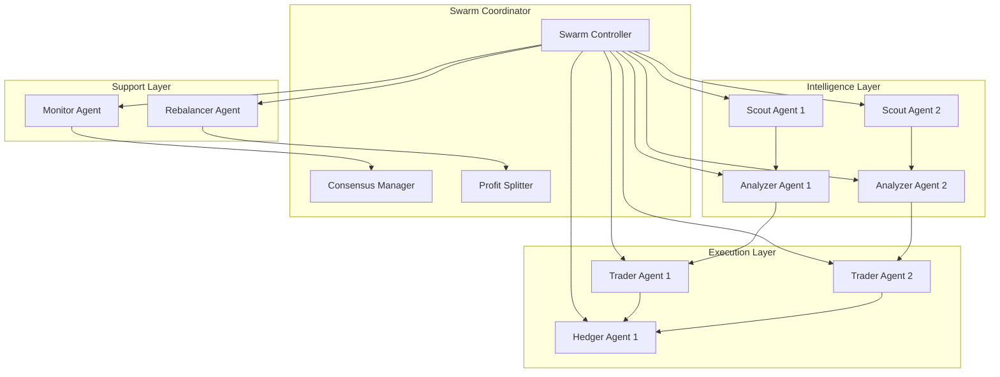
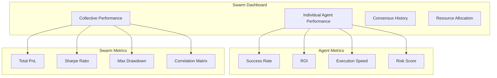

# Swarm Intelligence

Swarm intelligence is where individual agents collaborate to achieve superior performance through coordination, consensus, and shared learning. c0gni swarms consistently outperform individual agents by leveraging collective decision-making and specialized roles.

<Info>
**Performance Boost**: Swarms typically show 23% higher success rates and 35% better risk-adjusted returns compared to individual agents.
</Info>

## What is a Swarm?

A swarm is a coordinated group of specialized agents that work together toward common objectives while maintaining individual autonomy. Think of it as a hedge fund where each agent has a specific role and expertise.

<CardGroup cols={2}>
  <Card title="Collective Intelligence" icon="brain">
    **Enhanced Decision Making**
    
    Multiple agents contribute different perspectives, creating more robust trading decisions than any single agent could achieve.
  </Card>
  
  <Card title="Risk Distribution" icon="shield-check">
    **Portfolio Protection**
    
    Risk is spread across multiple strategies and agents, reducing the impact of any single failure or market event.
  </Card>
  
  <Card title="Specialization Benefits" icon="users-cog">
    **Role Optimization**
    
    Each agent focuses on what it does best - scouts find opportunities, analyzers assess risk, traders execute.
  </Card>
  
  <Card title="Emergent Behavior" icon="network-wired">
    **Collective Learning**
    
    Swarms develop strategies and behaviors that emerge from agent interactions, often discovering novel approaches.
  </Card>
</CardGroup>

## Swarm Architecture

### Hierarchical Structure



### Communication Protocol

```typescript
interface SwarmMessage {
  messageId: string;
  senderId: AgentId;
  recipientIds: AgentId[];
  messageType: MessageType;
  payload: MessagePayload;
  priority: Priority;
  timestamp: number;
  signature: string;
}

enum MessageType {
  OPPORTUNITY_ALERT = 'opportunity_detected',
  RISK_WARNING = 'risk_identified',
  EXECUTION_REQUEST = 'execute_trade',
  CONSENSUS_VOTE = 'consensus_vote',
  PROFIT_DISTRIBUTION = 'distribute_profits',
  PERFORMANCE_UPDATE = 'performance_update',
  EMERGENCY_HALT = 'emergency_stop'
}

interface ConsensusVote {
  proposalId: string;
  agentId: string;
  vote: 'APPROVE' | 'REJECT' | 'ABSTAIN';
  confidence: number;
  reasoning: string;
}
```

## Swarm Coordination Mechanisms

### 1. Opportunity Detection Pipeline

<Tabs>
  <Tab title="Discovery Phase">
    **Multi-Source Detection**
    
    ```python
    class SwarmDiscovery:
        def coordinate_detection(self):
            opportunities = []
            
            # Parallel scout operation
            scout_results = await asyncio.gather(
                self.scout_1.scan_new_launches(),
                self.scout_2.scan_arbitrage(),
                self.scout_3.scan_social_signals()
            )
            
            # Aggregate and deduplicate
            for result in scout_results:
                opportunities.extend(result.opportunities)
            
            # Filter and prioritize
            return self.prioritize_opportunities(opportunities)
    ```
    
    **Benefits:**
    - 3x faster opportunity detection
    - Reduced false positives through cross-validation
    - Comprehensive market coverage
    - Redundancy for critical opportunities
  </Tab>
  
  <Tab title="Analysis Phase">
    **Consensus Risk Assessment**
    
    ```typescript
    interface ConsensusAnalysis {
      opportunity: Opportunity;
      analysts: AnalyzerAgent[];
      votes: AnalysisVote[];
      consensus: 'STRONG_BUY' | 'BUY' | 'HOLD' | 'AVOID';
      confidenceLevel: number;
      dissentingViews: string[];
    }
    
    async function buildConsensus(
      opportunity: Opportunity, 
      analysts: AnalyzerAgent[]
    ): Promise<ConsensusAnalysis> {
      const analyses = await Promise.all(
        analysts.map(agent => agent.analyze(opportunity))
      );
      
      return {
        opportunity,
        analysts,
        votes: analyses,
        consensus: calculateConsensus(analyses),
        confidenceLevel: calculateConfidence(analyses),
        dissentingViews: identifyDissent(analyses)
      };
    }
    ```
  </Tab>
  
  <Tab title="Execution Phase">
    **Coordinated Trade Execution**
    
    ```python
    class SwarmExecution:
        async def execute_consensus_trade(self, consensus: ConsensusAnalysis):
            if consensus.confidence_level < 0.7:
                return self.reject_trade("Insufficient consensus")
            
            # Calculate optimal position sizing
            total_allocation = self.calculate_swarm_allocation(consensus)
            
            # Distribute execution across traders
            executions = await asyncio.gather(
                self.trader_1.execute(total_allocation * 0.6),
                self.trader_2.execute(total_allocation * 0.4)
            )
            
            # Immediate hedging if needed
            if consensus.risk_level == 'HIGH':
                await self.hedger.create_hedge(executions)
            
            return executions
    ```
  </Tab>
</Tabs>

### 2. Consensus Mechanisms

#### Voting Systems

<AccordionGroup>
  <Accordion title="Simple Majority">
    **Basic Democratic Voting**
    
    Each agent gets one vote on trade opportunities. Simple majority (>50%) decides execution.
    
    **Pros:** Fast decisions, equal representation
    
    **Cons:** May ignore expertise levels, binary outcomes
    
    **Best for:** Low-risk decisions, time-sensitive opportunities
  </Accordion>
  
  <Accordion title="Weighted Voting">
    **Performance-Based Influence**
    
    Agent votes weighted by historical performance, expertise, and confidence levels.
    
    ```typescript
    interface WeightedVote {
      agentId: string;
      vote: Decision;
      baseWeight: number;        // Agent's base influence
      performanceMultiplier: number;  // Recent performance modifier
      expertiseBonus: number;    // Domain expertise bonus
      confidenceLevel: number;   // Vote confidence
      finalWeight: number;       // Calculated total weight
    }
    ```
    
    **Pros:** Expertise-driven decisions, nuanced outcomes
    
    **Cons:** More complex, potential centralization
    
    **Best for:** High-stakes decisions, complex strategies
  </Accordion>
  
  <Accordion title="Proof of Performance">
    **Merit-Based Authority**
    
    Voting power determined by recent trading performance and contribution to swarm profits.
    
    **Advantages:**
    - Successful agents have more influence
    - Performance incentives aligned
    - Dynamic leadership based on results
    
    **Implementation:**
    ```python
    def calculate_voting_power(agent_performance):
        base_power = 1.0
        performance_multiplier = min(agent_performance.roi / 0.5, 3.0)
        consistency_bonus = agent_performance.sharpe_ratio * 0.2
        
        return base_power * performance_multiplier + consistency_bonus
    ```
  </Accordion>
</Tabs>

### 3. Resource Allocation

#### Capital Distribution

<Tabs>
  <Tab title="Equal Distribution">
    **Democratic Resource Sharing**
    
    ```python
    def distribute_capital_equally(total_capital, active_agents):
        per_agent_allocation = total_capital / len(active_agents)
        
        return {
            agent.id: per_agent_allocation 
            for agent in active_agents
        }
    ```
    
    **Use Case:** New swarms, similar agent capabilities
    
    **Pros:** Simple, fair, prevents dominance
    
    **Cons:** Ignores performance differences
  </Tab>
  
  <Tab title="Performance-Based">
    **Merit-Driven Allocation**
    
    ```python
    def distribute_by_performance(total_capital, agents):
        total_performance_score = sum(
            agent.performance_score for agent in agents
        )
        
        allocations = {}
        for agent in agents:
            share = agent.performance_score / total_performance_score
            allocations[agent.id] = total_capital * share
            
        return allocations
    ```
    
    **Use Case:** Mature swarms with performance history
    
    **Pros:** Rewards success, optimizes returns
    
    **Cons:** Can lead to concentration risk
  </Tab>
  
  <Tab title="Kelly Criterion">
    **Optimal Risk-Adjusted Sizing**
    
    ```python
    def kelly_allocation(agent_stats, total_capital):
        allocations = {}
        
        for agent in agents:
            win_rate = agent.success_rate
            avg_win = agent.average_win_pct
            avg_loss = agent.average_loss_pct
            
            # Kelly formula
            kelly_pct = (win_rate * avg_win - (1 - win_rate) * avg_loss) / avg_win
            
            # Apply safety factor
            safe_allocation = kelly_pct * 0.25  # Quarter Kelly
            allocations[agent.id] = total_capital * safe_allocation
            
        return allocations
    ```
    
    **Use Case:** Risk-optimized swarms
    
    **Pros:** Mathematically optimal, risk-aware
    
    **Cons:** Complex, requires extensive history
  </Tab>
</Tabs>

## Swarm Types & Configurations

### Pre-Configured Swarms

<CardGroup cols={2}>
  <Card title="Sniper Swarm" icon="crosshairs">
    **New Launch Specialists**
    
    **Composition:**
    - 2x Scout Agents (launch detection)
    - 2x Analyzer Agents (safety assessment)
    - 1x Trader Agent (execution)
    - 1x Hedger Agent (risk management)
    
    **Strategy:** Ultra-fast new token identification and execution
    
    **Performance:** 78% success rate, 2.8x average ROI
  </Card>
  
  <Card title="Arbitrage Team" icon="arrows-left-right">
    **Cross-DEX Profit Mining**
    
    **Composition:**
    - 1x Scout Agent (opportunity detection)
    - 1x Analyzer Agent (profit calculation)
    - 2x Trader Agents (simultaneous execution)
    - 1x Monitor Agent (performance tracking)
    
    **Strategy:** Risk-free profit from price differences
    
    **Performance:** 94% success rate, 1.3x average ROI
  </Card>
</CardGroup>

<CardGroup cols={2}>
  <Card title="LP Optimizer" icon="chart-line">
    **Yield Maximization**
    
    **Composition:**
    - 1x Monitor Agent (pool analysis)
    - 1x Analyzer Agent (IL assessment)
    - 1x Rebalancer Agent (position optimization)
    - 1x Hedger Agent (IL protection)
    
    **Strategy:** Automated liquidity management
    
    **Performance:** 89% uptime, 23% APY average
  </Card>
  
  <Card title="Hedge Fund" icon="building-columns">
    **Institutional Strategy**
    
    **Composition:**
    - 3x Scout Agents (multi-market coverage)
    - 2x Analyzer Agents (risk assessment)
    - 3x Trader Agents (diversified execution)
    - 2x Hedger Agents (portfolio protection)
    - 1x Rebalancer Agent (optimization)
    
    **Strategy:** Sophisticated multi-strategy approach
    
    **Performance:** 82% success rate, 4.2 Sharpe ratio
  </Card>
</CardGroup>

### Custom Swarm Configuration

```typescript
interface SwarmConfig {
  name: string;
  description: string;
  agents: AgentConfig[];
  coordinationRules: CoordinationRules;
  profitSharing: ProfitSharingRule;
  riskLimits: RiskLimits;
}

interface AgentConfig {
  type: AgentType;
  count: number;
  allocation: number;          // Percentage of total capital
  specialization?: string;     // Optional focus area
  parameters: AgentParameters;
}

interface CoordinationRules {
  consensusThreshold: number;  // Minimum agreement for execution
  votingSystem: VotingSystem;  // How decisions are made
  timeoutPeriod: number;       // Max time for consensus
  fallbackBehavior: string;    // What to do if no consensus
}
```

## Profit Sharing & Incentives

### Revenue Distribution

<Tabs>
  <Tab title="Performance-Based">
    **Merit-Driven Distribution**
    
    ```python
    def distribute_profits_by_performance(total_profit, agents):
        # Calculate each agent's contribution
        contributions = {}
        total_contribution_score = 0
        
        for agent in agents:
            # Weight by successful trades and profit generated
            contribution_score = (
                agent.successful_trades * 0.3 +
                agent.profit_generated * 0.5 +
                agent.risk_adjusted_return * 0.2
            )
            contributions[agent.id] = contribution_score
            total_contribution_score += contribution_score
        
        # Distribute profits proportionally
        distributions = {}
        for agent_id, score in contributions.items():
            share = score / total_contribution_score
            distributions[agent_id] = total_profit * share
            
        return distributions
    ```
  </Tab>
  
  <Tab title="Role-Based">
    **Function-Specific Rewards**
    
    | Role | Base Share | Performance Bonus | Risk Factor |
    |------|------------|------------------|-------------|
    | **Scout** | 15% | +5% for first detection | Low |
    | **Analyzer** | 20% | +10% for accurate risk assessment | Medium |
    | **Trader** | 35% | +15% for execution efficiency | High |
    | **Hedger** | 20% | +10% for drawdown reduction | Medium |
    | **Monitor** | 10% | +5% for system uptime | Low |
  </Tab>
  
  <Tab title="Hybrid Model">
    **Balanced Approach**
    
    ```typescript
    interface ProfitDistribution {
      baseAllocation: number;        // Equal share for participation
      performanceBonus: number;      // Merit-based bonus
      roleMultiplier: number;        // Role-specific adjustment
      riskPenalty: number;           // Deduction for losses
      swarmBonus: number;            // Team performance bonus
    }
    
    function calculateAgentShare(
      agent: Agent, 
      swarmPerformance: SwarmMetrics
    ): number {
      let share = BASE_SHARE;                          // 10% base
      share += agent.performanceScore * 0.4;           // Up to 40% for performance
      share *= ROLE_MULTIPLIERS[agent.type];          // Role adjustment
      share -= Math.max(0, agent.losses * 0.1);       // Loss penalty
      share += swarmPerformance.teamBonus * 0.05;     // Team bonus
      
      return Math.max(0.05, Math.min(0.50, share));   // Clamp between 5-50%
    }
    ```
  </Tab>
</Tabs>

## Swarm Learning & Evolution

### Collective Memory

```rust
#[account]
pub struct SwarmMemory {
    pub swarm_id: Pubkey,
    pub member_agents: Vec<Pubkey>,
    pub shared_patterns: Vec<Pattern>,
    pub collective_performance: PerformanceHistory,
    pub consensus_history: Vec<ConsensusDecision>,
    pub learned_strategies: Vec<Strategy>,
    pub coordination_rules: CoordinationRules,
}

#[derive(AnchorSerialize, AnchorDeserialize)]
pub struct Pattern {
    pub pattern_type: PatternType,
    pub conditions: Vec<MarketCondition>,
    pub success_rate: u8,
    pub confidence_level: u8,
    pub discovered_by: Pubkey,        // Which agent found it
    pub validated_by: Vec<Pubkey>,    // Which agents confirmed it
    pub usage_count: u64,
}
```

### Emergent Strategies

<AccordionGroup>
  <Accordion title="Strategy Discovery">
    **Collective Learning Process**
    
    1. **Individual Innovation**: Agents develop new approaches
    2. **Pattern Sharing**: Successful patterns shared with swarm
    3. **Collective Testing**: Other agents test and validate patterns
    4. **Consensus Integration**: Proven patterns become swarm knowledge
    5. **Continuous Refinement**: Ongoing optimization and adaptation
  </Accordion>
  
  <Accordion title="Adaptation Mechanisms">
    **Dynamic Behavior Modification**
    
    - **Market Regime Detection**: Identify bull/bear/sideways markets
    - **Strategy Switching**: Adapt tactics based on conditions
    - **Parameter Optimization**: Fine-tune based on recent performance
    - **Risk Adjustment**: Dynamic risk tolerance based on volatility
  </Accordion>
  
  <Accordion title="Knowledge Propagation">
    **Learning Distribution System**
    
    ```python
    class SwarmLearning:
        def propagate_learning(self, new_pattern: Pattern):
            # Validate pattern effectiveness
            validation_score = self.validate_pattern(new_pattern)
            
            if validation_score > VALIDATION_THRESHOLD:
                # Share with compatible agents
                compatible_agents = self.find_compatible_agents(new_pattern)
                
                for agent in compatible_agents:
                    agent.integrate_pattern(new_pattern)
                    
                # Update swarm memory
                self.swarm_memory.add_pattern(new_pattern)
                
                return f"Pattern integrated by {len(compatible_agents)} agents"
            
            return "Pattern validation failed"
    ```
  </Accordion>
</AccordionGroup>

## Monitoring Swarm Performance

### Key Metrics

<Info>
**Real-Time Monitoring**: All swarm metrics available via API and dashboard with sub-second updates
</Info>

| Metric | Description | Calculation |
|--------|-------------|-------------|
| **Swarm Efficiency** | Coordination effectiveness | Individual agent sum vs swarm performance |
| **Consensus Quality** | Decision-making accuracy | Correct decisions / total decisions |
| **Resource Utilization** | Capital deployment efficiency | Active capital / total capital |
| **Risk Distribution** | Portfolio diversification | Correlation between agent strategies |

### Performance Visualization



## Building Your First Swarm

<Steps>
  <Step title="Choose Swarm Template">
    Start with a pre-configured swarm like "Sniper Swarm" or "Arbitrage Team"
  </Step>
  
  <Step title="Set Capital Allocation">
    Determine total capital and allocation strategy (equal vs performance-based)
  </Step>
  
  <Step title="Configure Consensus Rules">
    Set voting thresholds, timeouts, and fallback behaviors
  </Step>
  
  <Step title="Deploy Agents">
    Create individual agents with complementary specializations
  </Step>
  
  <Step title="Monitor & Optimize">
    Track performance and adjust configuration based on results
  </Step>
</Steps>

<CardGroup cols={2}>
  <Card title="Deploy Swarm" icon="users" href="/platform/agent-cloud">
    Learn to create and manage agent swarms
  </Card>
  
  <Card title="Custom Configuration" icon="sliders" href="/guides/swarm-configuration">
    Advanced swarm setup and optimization
  </Card>
</CardGroup>