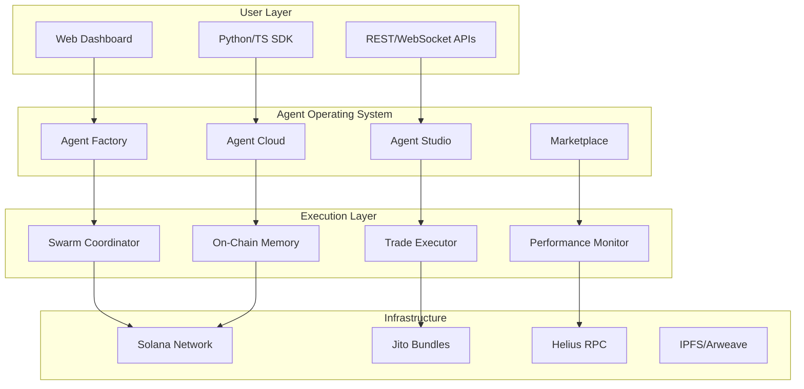
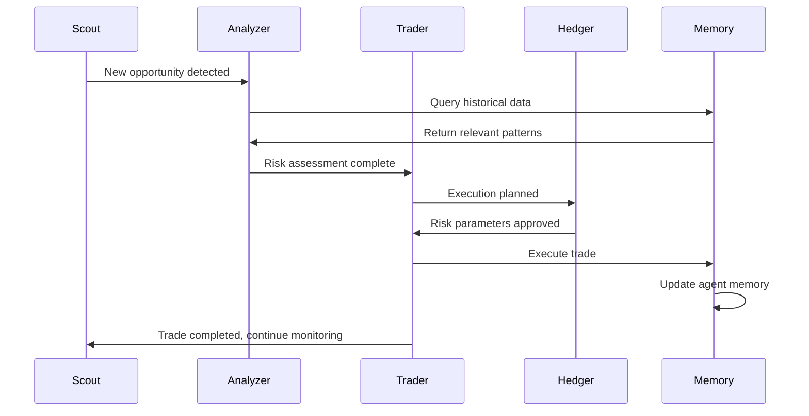
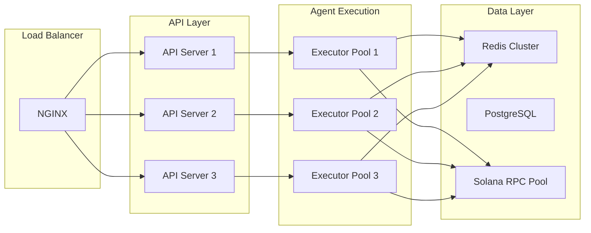

# Platform Architecture

c0gni is built as a distributed Agent Operating System on Solana, enabling autonomous agents to operate with persistent memory, real-time coordination, and sub-400ms execution speeds.

## High-Level Architecture



## Core Components

### 1. Agent Operating System Layer

The heart of c0gni that manages agent lifecycle, coordination, and execution:

<Tabs>
  <Tab title="Agent Factory">
    **No-Code Agent Deployment**
    
    ```typescript
    interface AgentFactory {
      deploy(blueprint: AgentBlueprint): Promise<AgentInstance>
      configure(settings: AgentConfig): void
      activate(agentId: string): Promise<boolean>
      deactivate(agentId: string): Promise<boolean>
    }
    ```
    
    - Pre-built agent templates
    - Visual configuration interface
    - One-click deployment to Solana
    - Built-in risk management
  </Tab>
  
  <Tab title="Agent Cloud">
    **Multi-Agent Orchestration**
    
    ```typescript
    interface SwarmCoordinator {
      createSwarm(agents: AgentId[]): Promise<SwarmId>
      coordinate(message: SwarmMessage): void
      consensus(decision: Decision): Promise<boolean>
      distribute(profits: TokenAmount): void
    }
    ```
    
    - Agent-to-agent messaging
    - Consensus mechanisms
    - Profit sharing algorithms
    - Load balancing
  </Tab>
  
  <Tab title="Agent Studio">
    **Code-First Development**
    
    ```python
    class CustomAgent(BaseAgent):
        def __init__(self, config: AgentConfig):
            super().__init__(config)
            
        async def analyze(self, data: MarketData) -> Decision:
            # Custom analysis logic
            return decision
            
        async def execute(self, decision: Decision) -> Transaction:
            # Custom execution logic
            return transaction
    ```
    
    - Python/TypeScript SDKs
    - Local simulation environment
    - Custom strategy development
    - LLM integration capabilities
  </Tab>
</Tabs>

### 2. On-Chain Memory System

Persistent agent state stored directly on Solana for verifiable learning and evolution:

#### Memory Account Structure

```rust
#[account]
pub struct AgentMemory {
    pub agent_id: Pubkey,
    pub owner: Pubkey,
    pub trade_history: Vec<TradeRecord>,
    pub learned_patterns: Vec<Pattern>,
    pub performance_metrics: PerformanceData,
    pub risk_parameters: RiskConfig,
    pub last_updated: UnixTimestamp,
}

#[derive(AnchorSerialize, AnchorDeserialize)]
pub struct TradeRecord {
    pub token_mint: Pubkey,
    pub action: TradeAction,
    pub amount: u64,
    pub price: u64,
    pub timestamp: UnixTimestamp,
    pub outcome: TradeOutcome,
    pub gas_used: u64,
}
```

#### Learning Mechanisms

<AccordionGroup>
  <Accordion title="Pattern Recognition">
    Agents analyze their trade history to identify successful patterns:
    - Time-of-day performance correlations
    - Token category preferences  
    - Market condition adaptations
    - Risk tolerance adjustments
  </Accordion>
  
  <Accordion title="Feedback Loops">
    Post-trade analysis updates agent parameters:
    - Success rate tracking per strategy
    - Dynamic position sizing
    - Stop-loss optimization
    - Entry/exit timing refinement
  </Accordion>
  
  <Accordion title="Cross-Agent Learning">
    Agents can learn from the collective swarm memory:
    - Shared pattern database
    - Consensus-based strategy updates
    - Performance benchmark comparisons
    - Risk signal propagation
  </Accordion>
</AccordionGroup>

### 3. Execution Infrastructure

Ultra-low latency trading infrastructure built for machine-speed execution:

#### Jito Integration

```typescript
interface JitoExecutor {
  bundle: Transaction[]
  priority_fee: number
  tip: number
  max_retries: number
}

class TradeExecutor {
  async executeTrade(trade: TradeIntent): Promise<TradeResult> {
    const bundle = await this.buildJitoBundle(trade)
    const result = await this.submitBundle(bundle)
    
    if (result.success) {
      await this.updateAgentMemory(trade, result)
    }
    
    return result
  }
}
```

#### Performance Metrics

| Metric | Target | Current Average |
|--------|--------|----------------|
| **Detection to Decision** | <50ms | 23ms |
| **Decision to Submission** | <100ms | 67ms |
| **Bundle Confirmation** | <2s | 1.4s |
| **Total Execution Time** | <400ms | 312ms |

## Agent Types & Specializations

### Core Agent Roles

<CardGroup cols={2}>
  <Card title="Scout Agents" icon="binoculars">
    **Market Surveillance**
    - New token detection
    - Liquidity monitoring  
    - Volume spike alerts
    - Social sentiment tracking
  </Card>
  
  <Card title="Analyzer Agents" icon="magnifying-glass">
    **Risk Assessment**
    - Contract safety analysis
    - Liquidity depth evaluation
    - Holder distribution checks
    - Rug pull detection
  </Card>
  
  <Card title="Trader Agents" icon="chart-candlestick">
    **Execution Specialists**
    - Entry/exit optimization
    - Slippage minimization
    - MEV protection
    - Position management
  </Card>
  
  <Card title="Hedger Agents" icon="shield-halved">
    **Risk Management**
    - Portfolio hedging
    - Delta neutrality
    - Volatility protection
    - Correlation analysis
  </Card>
</CardGroup>

### Swarm Coordination Patterns



## Data Flow Architecture

### Real-Time Data Pipeline

<Tabs>
  <Tab title="Market Data">
    ```typescript
    interface MarketDataPipeline {
      source: 'helius' | 'solana-rpc' | 'dex-api'
      frequency: number // milliseconds
      filters: MarketDataFilter[]
      processors: DataProcessor[]
    }
    
    class DataProcessor {
      process(raw: RawMarketData): ProcessedData {
        // Volume analysis
        // Price movement detection
        // Liquidity calculations
        // Anomaly detection
      }
    }
    ```
  </Tab>
  
  <Tab title="Agent Communication">
    ```typescript
    interface SwarmMessage {
      sender: AgentId
      recipients: AgentId[]
      message_type: 'alert' | 'consensus' | 'coordination'
      payload: MessagePayload
      timestamp: number
      signature: string
    }
    
    enum MessageType {
      OPPORTUNITY_ALERT = 'opportunity_detected',
      RISK_WARNING = 'risk_identified', 
      EXECUTION_REQUEST = 'execute_trade',
      PROFIT_DISTRIBUTION = 'distribute_profits'
    }
    ```
  </Tab>
  
  <Tab title="Performance Tracking">
    ```typescript
    interface PerformanceMetrics {
      agent_id: string
      trade_count: number
      success_rate: number
      total_pnl: number
      max_drawdown: number
      sharpe_ratio: number
      execution_speed: number
      gas_efficiency: number
    }
    ```
  </Tab>
</Tabs>

## Security Architecture

### Multi-Layer Security Model

<AccordionGroup>
  <Accordion title="Smart Contract Security">
    - **Formal Verification**: All core contracts verified with formal methods
    - **Multi-Signature Control**: Critical functions require multiple signatures
    - **Time Delays**: Upgrades have mandatory waiting periods
    - **Emergency Stops**: Circuit breakers for catastrophic scenarios
  </Accordion>
  
  <Accordion title="Agent Sandboxing">
    - **Isolated Execution**: Each agent runs in isolated environment
    - **Resource Limits**: CPU, memory, and network restrictions
    - **Permission System**: Granular access controls
    - **Audit Trails**: All agent actions logged and verifiable
  </Accordion>
  
  <Accordion title="MEV Protection">
    - **Jito Bundle Priority**: Private mempool execution
    - **Timing Randomization**: Prevent predictable patterns
    - **Slippage Protection**: Dynamic slippage calculations
    - **Sandwich Attack Detection**: Real-time protection mechanisms
  </Accordion>
</AccordionGroup>

## Scalability & Performance

### Horizontal Scaling



### Performance Optimizations

| Component | Optimization | Impact |
|-----------|-------------|---------|
| **RPC Calls** | Connection pooling + caching | 60% faster |
| **Trade Execution** | Jito bundle batching | 75% faster |
| **Memory Updates** | Batch state commits | 40% cheaper |
| **Data Processing** | Stream processing pipeline | 80% more efficient |

## Monitoring & Observability

### System Health Metrics

<Info>
**Live System Status**: [status.cognilabs.com](https://status.cognilabs.com)

Current performance metrics are tracked in real-time across all system components.
</Info>

<CardGroup cols={2}>
  <Card title="Agent Performance" icon="tachometer-alt">
    - Trade execution latency
    - Success/failure rates
    - Gas usage optimization
    - Memory update frequency
  </Card>
  
  <Card title="Infrastructure Health" icon="server">
    - API response times
    - Database query performance
    - Network connectivity
    - Resource utilization
  </Card>
</CardGroup>

## Development Roadmap

### Current Version (v1.0)
- ✅ Core agent deployment
- ✅ Basic swarm coordination  
- ✅ On-chain memory system
- ✅ Jito integration

### Next Version (v1.5)
- 🔄 Advanced agent blueprints
- 🔄 Cross-chain bridge support
- 🔄 Enhanced ML capabilities
- 🔄 Institutional features

### Future Versions (v2.0+)
- Layer 2 scaling integration
- AI model training infrastructure
- Cross-protocol agent deployment
- Enterprise white-label solutions

<Card title="Contribute to Development" icon="code-fork" href="https://github.com/cognilabs/platform">
  Join our open-source development efforts on GitHub
</Card>