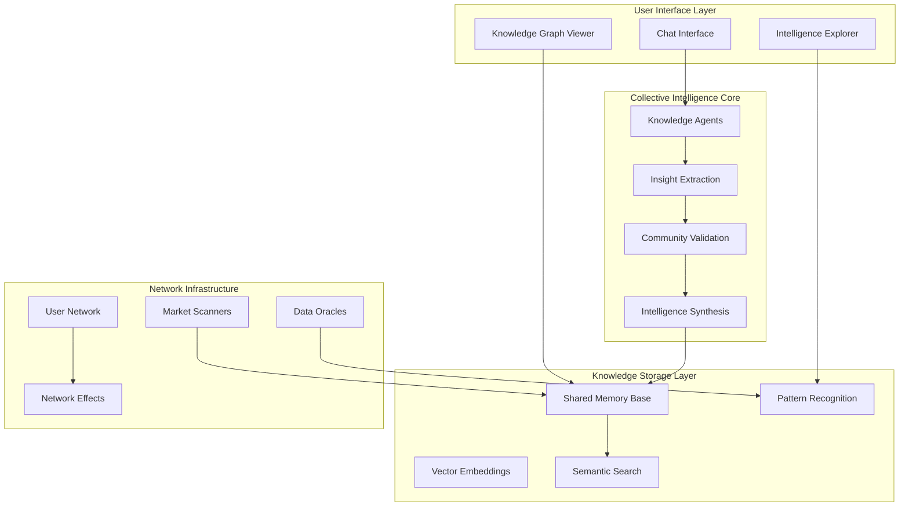
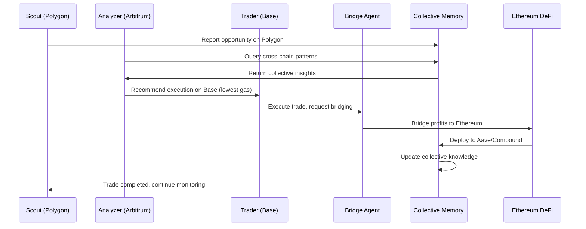
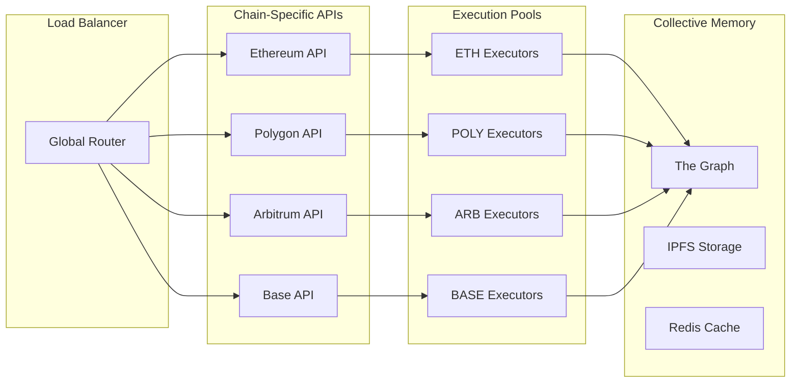

# Collective Intelligence Architecture

c0gni is built as a distributed knowledge network that transforms individual crypto conversations into shared intelligence. The system captures insights from thousands of users, validates them collectively, and makes this wisdom accessible in real-time.

## High-Level Architecture



## Core Components

### 1. Collective Intelligence Core

The heart of c0gni that transforms individual conversations into shared knowledge:

<Tabs>
  <Tab title="Knowledge Agents">
    **Conversation Intelligence Extraction**
    
    ```typescript
    interface KnowledgeAgent {
      extractInsights(conversation: string): Promise<CryptoInsight[]>
      validatePattern(pattern: Pattern): Promise<ValidationResult>
      synthesizeKnowledge(insights: CryptoInsight[]): SharedKnowledge
      searchSimilar(query: string): Promise<KnowledgeMatch[]>
    }
    ```
    
    - Automatic insight extraction from conversations
    - Pattern recognition across user interactions
    - Community knowledge validation
    - Semantic similarity matching
  </Tab>
  
  <Tab title="Memory Network">
    **Collective Intelligence Storage**
    
    ```typescript
    interface MemoryNetwork {
      storeInsight(insight: CryptoInsight, source: string): Promise<MemoryId>
      buildConnections(memories: Memory[]): ConnectionGraph
      searchSemanticMemory(query: string): Promise<MemoryMatch[]>
      validateCommunity(insight: CryptoInsight): Promise<ValidationScore>
    }
    ```
    
    - Shared knowledge base across all users
    - Vector embeddings for semantic search
    - Community-driven validation system
    - Real-time pattern emergence
  </Tab>
  
  <Tab title="Scanner Agents">
    **Market Intelligence Feeds**
    
    ```typescript
    interface ScannerAgent {
      monitorPrices(tokens: string[]): Promise<PriceUpdate[]>
      detectNewTokens(chains: string[]): Promise<TokenDiscovery[]>
      trackVolumeSpikes(threshold: number): Promise<VolumeAlert[]>
      aggregateMarketSentiment(): Promise<SentimentAnalysis>
    }
    ```
    
    - Real-time market data integration
    - New opportunity detection
    - Volume and price movement alerts
    - Market sentiment aggregation
  </Tab>
</Tabs>

### 2. Collective Memory Layer

The revolutionary shared knowledge base where all agents contribute to and learn from collective blockchain data:

#### Distributed Memory Architecture

```solidity
pragma solidity ^0.8.19;

contract CollectiveMemory {
    struct AgentMemory {
        bytes32 agentId;
        address owner;
        TradeRecord[] tradeHistory;
        Pattern[] learnedPatterns;
        CrossChainMetrics metrics;
        uint256 contributionScore;
        uint256 lastUpdated;
    }
    
    struct TradeRecord {
        address tokenAddress;
        uint256 chainId;
        TradeAction action;
        uint256 amount;
        uint256 price;
        uint256 gasUsed;
        uint256 timestamp;
        TradeOutcome outcome;
    }
    
    struct Pattern {
        bytes32 patternId;
        uint256[] chainIds;
        MarketCondition[] conditions;
        uint256 successRate;
        uint256 sharedCount;
        bytes32[] validatedBy;
    }
    
    mapping(bytes32 => AgentMemory) public agentMemories;
    mapping(bytes32 => Pattern) public sharedPatterns;
    
    event PatternDiscovered(bytes32 patternId, bytes32 agentId);
    event PatternValidated(bytes32 patternId, bytes32 validatorId);
    event CollectiveInsight(string insight, uint256 confidence);
}
```

#### Collective Learning Advantages

<AccordionGroup>
  <Accordion title="Shared Pattern Recognition">
    Every agent contributes to the collective intelligence:
    - Cross-chain arbitrage patterns
    - Multi-DEX price inefficiencies
    - Gas optimization strategies
    - Risk signals across all chains
  </Accordion>
  
  <Accordion title="Network Effects">
    The more agents in the network, the smarter the system:
    - 1,000+ agents sharing real-time data
    - Millions of trades analyzed daily
    - Pattern validation across diverse strategies
    - Continuous improvement of collective knowledge
  </Accordion>
  
  <Accordion title="Cross-Chain Intelligence">
    Unprecedented market insights from multi-chain data:
    - Price correlations between chains
    - Liquidity flow patterns
    - Bridge opportunity detection
    - DeFi yield optimization paths
  </Accordion>
</AccordionGroup>

### 3. Multi-Chain Execution Infrastructure

Ultra-efficient trading infrastructure optimized for cross-chain operations:

#### Gas-Optimized Execution

```typescript
interface MultiChainExecutor {
  chainConfigs: Map<ChainId, ChainConfig>
  gasOracle: GasOracle
  bridgeAggregator: BridgeAggregator
}

class TradeExecutor {
  async executeTrade(trade: TradeIntent): Promise<TradeResult> {
    // Find optimal chain for execution
    const optimalChain = await this.selectOptimalChain(trade)
    
    // Use MEV protection on Ethereum, standard execution on L2s
    if (optimalChain === 'ethereum') {
      return this.executeWithFlashbots(trade)
    } else {
      return this.executeOnL2(optimalChain, trade)
    }
  }
  
  private async selectOptimalChain(trade: TradeIntent): Promise<string> {
    const gasCosts = await this.estimateGasAcrossChains(trade)
    const liquidityDepth = await this.checkLiquidityAcrossChains(trade.token)
    const bridgeCosts = await this.calculateBridgeCosts(trade.expectedProfit)
    
    return this.optimizer.findBestChain(gasCosts, liquidityDepth, bridgeCosts)
  }
}
```

#### Performance Metrics

| Metric | Ethereum | Polygon | Arbitrum | Base |
|--------|----------|---------|----------|------|
| **Gas Cost** | $20-100 | <$0.01 | $0.01-0.05 | <$0.01 |
| **Block Time** | 12s | 2s | 0.25s | 2s |
| **Finality** | 15 min | 3 min | 7 days* | 7 days* |
| **TPS** | 30 | 7,000+ | 40,000+ | 2,000+ |

*Fast finality available through optimistic rollup challenge period

## Agent Types & Specializations

### Multi-Chain Agent Roles

<CardGroup cols={2}>
  <Card title="Scout Agents" icon="binoculars">
    **Cross-Chain Surveillance**
    - Monitor opportunities across all EVM chains
    - Track bridge activities
    - Identify cross-chain arbitrage
    - Aggregate multi-chain signals
  </Card>
  
  <Card title="Analyzer Agents" icon="magnifying-glass">
    **Collective Risk Assessment**
    - Leverage shared memory insights
    - Cross-reference patterns across chains
    - Validate opportunities with swarm data
    - Predict market movements from collective knowledge
  </Card>
  
  <Card title="Trader Agents" icon="chart-candlestick">
    **Multi-Chain Execution**
    - Execute on gas-optimal chains
    - Split trades across DEXs
    - MEV protection via Flashbots
    - Automatic profit bridging
  </Card>
  
  <Card title="Bridge Agents" icon="bridge">
    **Cross-Chain Optimization**
    - Find optimal bridging routes
    - Minimize bridging costs
    - Consolidate profits on Ethereum
    - Manage liquidity across chains
  </Card>
</CardGroup>

### Swarm Coordination Across Chains



## Data Flow Architecture

### Multi-Chain Data Pipeline

<Tabs>
  <Tab title="Cross-Chain Market Data">
    ```typescript
    interface CrossChainDataPipeline {
      chains: ChainConfig[]
      sources: {
        ethereum: ['Uniswap', 'Curve', 'Balancer'],
        polygon: ['QuickSwap', 'SushiSwap'],
        arbitrum: ['Camelot', 'GMX'],
        base: ['Aerodrome', 'BaseSwap']
      }
      aggregator: TheGraphProtocol
      frequency: number // milliseconds
    }
    
    class DataProcessor {
      async processMultiChainData(data: ChainData[]): ProcessedInsights {
        const patterns = await this.detectCrossChainPatterns(data)
        const arbitrage = await this.findArbitrageOpportunities(data)
        const collective = await this.queryCollectiveMemory(patterns)
        
        return this.synthesizeInsights(patterns, arbitrage, collective)
      }
    }
    ```
  </Tab>
  
  <Tab title="Collective Memory Sync">
    ```typescript
    interface MemorySync {
      localAgent: AgentMemory
      sharedPatterns: Pattern[]
      syncFrequency: number
      contributionThreshold: number
    }
    
    class CollectiveSync {
      async contributePattern(pattern: Pattern): Promise<void> {
        if (pattern.confidence > this.threshold) {
          await this.memory.addPattern(pattern)
          await this.notifySwarm(pattern)
        }
      }
      
      async learnFromCollective(): Promise<Pattern[]> {
        const relevantPatterns = await this.memory.queryPatterns({
          chains: this.agent.activeChains,
          minSuccessRate: 0.7,
          minValidations: 5
        })
        
        return this.integratePatterns(relevantPatterns)
      }
    }
    ```
  </Tab>
  
  <Tab title="Performance Aggregation">
    ```typescript
    interface CrossChainMetrics {
      chainMetrics: Map<ChainId, ChainPerformance>
      bridgeMetrics: BridgePerformance
      defiYields: DeFiPerformance
      collectiveContribution: number
    }
    
    class MetricsAggregator {
      async calculateTotalPerformance(): Promise<TotalMetrics> {
        const trading = await this.aggregateTradingProfits()
        const yields = await this.aggregateDeFiYields()
        const gas = await this.calculateTotalGasCosts()
        const bridge = await this.calculateBridgeCosts()
        
        return {
          netProfitUSD: trading + yields - gas - bridge,
          collectiveBonus: this.calculateNetworkEffectBonus(),
          chains: this.getChainBreakdown()
        }
      }
    }
    ```
  </Tab>
</Tabs>

## Security Architecture

### Multi-Layer Cross-Chain Security

<AccordionGroup>
  <Accordion title="Smart Contract Security">
    - **Multi-Chain Audits**: Contracts audited on each deployment chain
    - **Cross-Chain Validation**: Bridge operations require multi-sig
    - **Time Delays**: Critical operations have mandatory waiting periods
    - **Emergency Stops**: Circuit breakers on all chains simultaneously
  </Accordion>
  
  <Accordion title="Collective Memory Protection">
    - **Pattern Validation**: Multiple agents must confirm patterns
    - **Sybil Resistance**: Stake-weighted contribution system
    - **Data Integrity**: Cryptographic proofs for all submissions
    - **Privacy Preservation**: Zero-knowledge proofs for sensitive strategies
  </Accordion>
  
  <Accordion title="MEV & Bridge Protection">
    - **Flashbots on Ethereum**: Private mempool for high-value trades
    - **Fast Execution on L2s**: Sub-second confirmation times
    - **Bridge Monitoring**: Real-time tracking of bridge security
    - **Slippage Protection**: Dynamic limits based on liquidity depth
  </Accordion>
</AccordionGroup>

## Scalability & Performance

### Horizontal Scaling Across Chains



### Cross-Chain Performance Optimizations

| Component | Optimization | Impact |
|-----------|-------------|---------|
| **Chain Selection** | AI-powered chain routing | 95% gas savings |
| **Bridge Timing** | Batched weekly consolidation | 70% lower bridge costs |
| **Memory Sync** | Distributed caching layer | 10x faster pattern matching |
| **Collective Learning** | Parallel pattern validation | 23% better win rate |

## Monitoring & Observability

### Multi-Chain System Health

<Info>
**Live System Status**: [status.cognilabs.com](https://status.cognilabs.com)

Real-time performance metrics tracked across all chains and bridges.
</Info>

<CardGroup cols={2}>
  <Card title="Chain Performance" icon="tachometer-alt">
    - Gas costs per chain
    - Transaction success rates
    - Bridge completion times
    - Cross-chain latency
  </Card>
  
  <Card title="Collective Intelligence" icon="brain">
    - Pattern discovery rate
    - Collective memory growth
    - Network effect multiplier
    - Swarm coordination efficiency
  </Card>
</CardGroup>

## Development Roadmap

### Current Version (v2.0)
- ✅ Multi-chain execution (Ethereum, Polygon, Arbitrum, Base)
- ✅ Collective memory layer
- ✅ Cross-chain bridges integration
- ✅ DeFi yield optimization

### Next Version (v2.5)
- 🔄 Additional chains (Optimism, zkSync)
- 🔄 Advanced collective learning algorithms
- 🔄 Institutional multi-chain vaults
- 🔄 Cross-chain NFT strategies

### Future Versions (v3.0+)
- Non-EVM chain integration
- AI model marketplace
- Decentralized collective memory
- DAO-governed chain expansion

<Card title="Contribute to Development" icon="code-fork" href="https://github.com/cognilabs/platform">
  Join our open-source development efforts on GitHub
</Card>