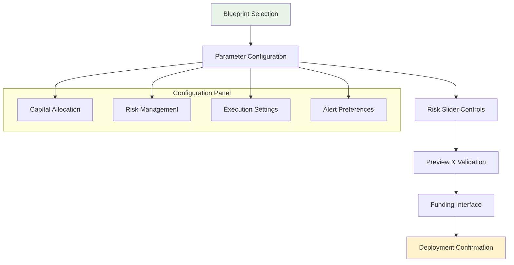

# Agent Factory

The Agent Factory enables anyone to deploy sophisticated trading agents without writing a single line of code. Choose from battle-tested blueprints, configure your parameters, and launch autonomous agents in under 60 seconds.

<CardGroup cols={2}>
  <Card title="Pre-Built Blueprints" icon="puzzle-piece">
    **Production-Ready Strategies**
    
    Proven agent templates optimized for different market conditions and risk profiles
  </Card>
  
  <Card title="No-Code Configuration" icon="mouse-pointer">
    **Visual Interface**
    
    Intuitive drag-and-drop interface for setting parameters and risk controls
  </Card>
  
  <Card title="60-Second Deployment" icon="rocket">
    **Instant Launch**
    
    From configuration to live trading in under a minute
  </Card>
  
  <Card title="Built-In Safety" icon="shield-check">
    **Automatic Risk Management**
    
    Pre-configured stop losses, position limits, and emergency controls
  </Card>
</CardGroup>

## Available Agent Blueprints

### Sniper Agents

<Tabs>
  <Tab title="Sniper V3">
    **New Launch Specialist**
    
    ```json
    {
      "name": "Sniper V3",
      "description": "Detects and trades new token launches with ML-powered safety analysis",
      "strategy": {
        "detection_speed": "<5 seconds",
        "safety_analysis": "Advanced contract scanning",
        "execution_method": "MEV protection via Flashbots on Ethereum, fast L2 execution",
        "position_sizing": "Dynamic based on liquidity"
      },
      "performance": {
        "success_rate": "73.2%",
        "average_roi": "2.3x",
        "max_drawdown": "18.5%",
        "trades_per_day": "8-15"
      },
      "risk_level": "Medium-High",
      "minimum_capital": "1,000 COGNI tokens",
      "recommended_capital": "5,000-10,000 COGNI tokens"
    }
    ```
    
    **Key Features:**
    - Real-time new launch detection
    - Contract safety verification
    - Social sentiment analysis
    - Automatic profit taking
    - Built-in rug pull protection
  </Tab>
  
  <Tab title="Conservative Sniper">
    **Safety-First Approach**
    
    Lower risk version with enhanced due diligence:
    
    - Extended verification period (30+ seconds)
    - Multiple safety checks required
    - Lower position sizes (max 10% per trade)
    - Strict liquidity requirements ($100k+ minimum)
    - Community validation scoring
    
    **Performance:** 86% success rate, 1.4x average ROI
  </Tab>
  
  <Tab title="Speed Sniper">
    **Ultra-Fast Execution**
    
    Optimized for maximum speed at higher risk:
    
    - <2 second detection to execution
    - Minimal safety delays
    - Higher position sizes (up to 30%)
    - Accepts lower liquidity thresholds
    - Priority fee optimization
    
    **Performance:** 68% success rate, 3.1x average ROI
  </Tab>
</Tabs>

### Arbitrage Engines

<Tabs>
  <Tab title="Cross-DEX Arbitrage">
    **Multi-Exchange Profit Mining**
    
    ```typescript
    interface ArbitrageBlueprint {
      name: "Cross-DEX Arbitrage V2";
      
      exchanges: ["Uniswap", "Curve", "Balancer", "1inch"];
      
      detection: {
        min_spread: 0.5%;           // 0.5% minimum profit
        max_trade_size: 50_000;     // $50k per arbitrage trade
        execution_timeout: 30_sec;   // Max time to complete
      };
      
      execution: {
        simultaneous_trades: true;   // Buy and sell together
        flash_loans: true;          // Use flash loans when beneficial
        mev_protection: true;       // Flashbots on Ethereum
        retry_attempts: 3;          // Failed trade retries
      };
      
      performance: {
        success_rate: 94.2%;
        average_roi: 1.2%;          // Per trade
        daily_trades: 25-40;
        capital_efficiency: "High"; // Multiple trades per day
      };
    }
    ```
  </Tab>
  
  <Tab title="Triangular Arbitrage">
    **Multi-Hop Profit Cycles**
    
    Exploits price inefficiencies across trading pairs:
    
    - **Route Discovery**: ETH → TOKEN → USDC → ETH across chains
    - **Cycle Optimization**: Find most profitable paths
    - **Atomic Execution**: All trades in single transaction
    - **Risk Management**: Account for fees and slippage
    
    **Best For**: Large capital amounts ($10,000+)
  </Tab>
</Tabs>

### LP Optimizers

<Tabs>
  <Tab title="Yield Maximizer">
    **Dynamic Pool Management**
    
    Automatically manages liquidity positions for maximum returns:
    
    ```python
    class YieldMaximizerConfig:
        def __init__(self):
            self.target_pools = [
                'ETH/USDC',     # Stable, high volume
                'MATIC/USDC',   # Polygon native
                'ARB/ETH',      # Arbitrum governance
            ]
            
            self.rebalance_triggers = {
                'apr_threshold': 0.15,      # Move if APR < 15%
                'il_threshold': 0.05,       # Rebalance if IL > 5%
                'volume_decline': 0.3,      # Exit if volume drops 30%
            }
            
            self.safety_features = {
                'max_il_exposure': 0.10,    # Never exceed 10% IL
                'position_limits': 0.25,    # Max 25% in any pool
                'emergency_exit': True,     # Auto-exit on market crash
            }
    ```
  </Tab>
  
  <Tab title="IL Protector">
    **Impermanent Loss Minimization**
    
    Focuses on protecting against impermanent loss:
    
    - **Correlation Monitoring**: Track asset price relationships
    - **Dynamic Hedging**: Hedge positions when divergence detected
    - **Pool Selection**: Prefer stable or correlated asset pairs
    - **Exit Triggers**: Automatic exit when IL risk increases
    
    **Target Pools**: Stablecoin pairs, wrapped assets, correlated tokens
  </Tab>
</Tabs>

### Trend Followers

<Tabs>
  <Tab title="Momentum Trader">
    **Trend Following Specialist**
    
    Identifies and rides price momentum with intelligent exits:
    
    ```json
    {
      "strategy": {
        "timeframes": ["5m", "15m", "1h"],
        "indicators": ["RSI", "MACD", "Volume", "Social_Sentiment"],
        "entry_conditions": [
          "Strong volume confirmation",
          "Technical breakout pattern", 
          "Positive social sentiment shift",
          "Multiple timeframe alignment"
        ],
        "exit_strategy": {
          "profit_taking": "Trailing stops with volatility adjustment",
          "stop_loss": "ATR-based dynamic stops",
          "time_limit": "Max 4 hours per trade"
        }
      },
      
      "performance": {
        "success_rate": "71.5%",
        "average_roi": "1.8x",
        "holding_period": "45 minutes average",
        "sharpe_ratio": "2.1"
      }
    }
    ```
  </Tab>
  
  <Tab title="Breakout Hunter">
    **Technical Pattern Recognition**
    
    Specialized in identifying and trading technical breakouts:
    
    - **Pattern Recognition**: Triangles, flags, rectangles
    - **Volume Confirmation**: Ensure breakout authenticity  
    - **False Breakout Protection**: Multiple confirmation signals
    - **Risk Management**: Tight stops below breakout levels
  </Tab>
</Tabs>

## Factory Interface

### Step-by-Step Deployment

<Steps>
  <Step title="Select Blueprint">
    **Choose Your Strategy**
    
    Browse available blueprints with filtering options:
    
    ```typescript
    interface BlueprintFilter {
      riskLevel: 'LOW' | 'MEDIUM' | 'HIGH';
      minCapital: number;           // Minimum COGNI stake required
      strategyType: 'SNIPER' | 'ARBITRAGE' | 'LP' | 'TREND';
      successRate: number;          // Minimum success rate
      timeCommitment: 'PASSIVE' | 'ACTIVE';
    }
    ```
    
    **Blueprint Cards Show:**
    - Performance metrics and backtests
    - Risk/reward profile
    - Capital requirements  
    - User ratings and reviews
    - Real agent performance data
  </Step>
  
  <Step title="Configure Parameters">
    **Customize Your Agent**
    
    Adjust key parameters through visual interface:
    
    ```json
    {
      "capital_allocation": {
        "total_budget": 5000,         // COGNI tokens
        "max_position_size": 0.2,     // 20% per trade
        "reserve_buffer": 0.1         // 10% emergency reserve
      },
      
      "risk_management": {
        "stop_loss": 0.15,            // 15% max loss per trade
        "take_profit": 2.0,           // 200% profit target
        "daily_loss_limit": 0.05,     // 5% daily limit
        "max_drawdown": 0.20          // 20% portfolio limit
      },
      
      "execution_preferences": {
        "slippage_tolerance": 0.05,   // 5% max slippage
        "priority_fees": "AUTO",      // Dynamic fee optimization
        "mev_protection": true,       // Use Flashbots/L2 speed
        "partial_fills": true         // Accept partial execution
      }
    }
    ```
  </Step>
  
  <Step title="Risk Assessment">
    **Safety Validation**
    
    Automated risk assessment before deployment:
    
    ```typescript
    interface RiskAssessment {
      capitalAtRisk: {
        maxSingleTrade: number;       // Largest possible loss
        dailyRiskLimit: number;       // Max daily exposure
        worstCaseScenario: number;    // Stress test result
      };
      
      configuration: {
        riskScore: number;            // 0-100 risk rating
        balanceRating: 'CONSERVATIVE' | 'BALANCED' | 'AGGRESSIVE';
        recommendations: string[];    // Suggested adjustments
      };
      
      approval: {
        autoApproved: boolean;
        warnings: string[];           // Important notices
        requiresConfirmation: boolean; // Manual approval needed
      };
    }
    ```
  </Step>
  
  <Step title="Deploy & Fund">
    **Launch Your Agent**
    
    Final deployment process:
    
    1. **Generate Agent Wallet**: Create EVM addresses for each chain
    2. **Deploy Smart Contract**: Deploy across selected chains
    3. **Stake COGNI**: Lock tokens to activate agent
    4. **Activate Monitoring**: Start market surveillance
    5. **Begin Operations**: Agent starts trading automatically
  </Step>
</Steps>

### Visual Configuration Interface



## Advanced Factory Features

### Template Customization

<Tabs>
  <Tab title="Parameter Templates">
    **Saved Configurations**
    
    Save and reuse successful configurations:
    
    ```typescript
    interface ParameterTemplate {
      name: string;
      description: string;
      blueprint: string;           // Base blueprint ID
      parameters: AgentParameters;
      performance: {
        backtestResults: BacktestMetrics;
        liveResults?: LiveMetrics;
      };
      tags: string[];             // Searchable tags
      shared: boolean;            // Available to community
      rating: number;             // Community rating
    }
    ```
    
    **Benefits:**
    - Quick deployment of proven configurations
    - Share successful setups with community
    - A/B test different parameter sets
    - Version control for configurations
  </Tab>
  
  <Tab title="Community Templates">
    **Shared Configurations**
    
    Access templates shared by successful traders:
    
    - **Top Performer Templates**: Configurations from best agents
    - **Risk-Adjusted Templates**: Optimized for different risk levels
    - **Market Condition Templates**: Configs for bull/bear/crab markets
    - **Capital Size Templates**: Optimized for different capital amounts
    
    ```json
    {
      "template": "Bull Market Sniper",
      "author": "0x7D...F3C8",
      "author_rating": 4.8,
      "performance": {
        "30_day_roi": "156.7%",
        "success_rate": "78.3%",
        "max_drawdown": "12.4%"
      },
      "usage_stats": {
        "deployments": 234,
        "avg_performance": "87.2%",
        "satisfaction": 4.6
      }
    }
    ```
  </Tab>
  
  <Tab title="A/B Testing">
    **Configuration Comparison**
    
    Test multiple configurations simultaneously:
    
    ```python
    class ABTestManager:
        def create_ab_test(self, blueprint, config_a, config_b, test_duration):
            """Create A/B test with two configurations"""
            
            return {
                'test_id': generate_test_id(),
                'blueprint': blueprint,
                'configurations': {
                    'A': {
                        'config': config_a,
                        'allocation': 0.5,  # 50% of capital
                        'agent_id': deploy_agent(blueprint, config_a)
                    },
                    'B': {
                        'config': config_b, 
                        'allocation': 0.5,
                        'agent_id': deploy_agent(blueprint, config_b)
                    }
                },
                'duration_days': test_duration,
                'metrics_tracking': [
                    'success_rate', 'roi', 'sharpe_ratio', 
                    'max_drawdown', 'execution_speed'
                ]
            }
    ```
  </Tab>
</Tabs>

### Deployment Scheduling

<AccordionGroup>
  <Accordion title="Market Timing">
    **Optimal Launch Timing**
    
    Schedule agent deployment for optimal market conditions:
    
    ```typescript
    interface DeploymentSchedule {
      triggerConditions: {
        marketConditions: 'BULL' | 'BEAR' | 'SIDEWAYS' | 'ANY';
        volatilityRange: [number, number];    // Min/max volatility
        timeOfDay: [number, number];          // Hour range (0-23)
        dayOfWeek: number[];                  // 0=Sunday, 6=Saturday
        liquidityThreshold: number;           // Minimum market liquidity
      };
      
      notifications: {
        beforeDeployment: boolean;
        deploymentConfirm: boolean;  
        firstTradeAlert: boolean;
      };
      
      fallbackActions: {
        maxWaitTime: number;                  // Hours to wait
        deployAnyway: boolean;                // Deploy despite conditions
        alternativeBlueprint?: string;        // Backup strategy
      };
    }
    ```
  </Accordion>
  
  <Accordion title="Auto-Scaling">
    **Dynamic Capital Allocation**
    
    Automatically scale successful agents:
    
    ```python
    class AutoScaler:
        def __init__(self):
            self.scaling_rules = {
                'performance_threshold': 0.8,     # 80% success rate
                'confidence_period': 7,           # 7 days validation
                'max_scale_factor': 3.0,          # 3x original capital
                'scale_increment': 0.5,           # 50% increases
            }
        
        def evaluate_scaling(self, agent_performance):
            if (agent_performance.success_rate > self.scaling_rules['performance_threshold'] and
                agent_performance.days_active > self.scaling_rules['confidence_period']):
                
                new_allocation = min(
                    agent_performance.current_capital * 1.5,
                    agent_performance.original_capital * self.scaling_rules['max_scale_factor']
                )
                
                return {
                    'scale_recommended': True,
                    'new_allocation': new_allocation,
                    'reason': 'Consistent outperformance detected'
                }
    ```
  </Accordion>
  
  <Accordion title="Portfolio Integration">
    **Multi-Agent Orchestration**
    
    Deploy complementary agents for portfolio optimization:
    
    - **Correlation Analysis**: Ensure strategy diversity
    - **Risk Balancing**: Maintain target portfolio risk
    - **Capital Allocation**: Optimize across multiple agents
    - **Rebalancing**: Dynamic allocation adjustments
  </Accordion>
</AccordionGroup>

## Factory Analytics & Insights

### Blueprint Performance Tracking

<CardGroup cols={2}>
  <Card title="Success Metrics" icon="chart-line">
    **Blueprint Effectiveness**
    
    Track how each blueprint performs across all deployments:
    
    - Average success rate by blueprint
    - ROI distribution analysis
    - User satisfaction ratings  
    - Deployment frequency trends
  </Card>
  
  <Card title="Market Adaptation" icon="trending-up">
    **Performance by Conditions**
    
    Analyze blueprint performance across different market conditions:
    
    - Bull vs bear market performance
    - High vs low volatility periods
    - Different time-of-day patterns
    - Seasonal performance variations
  </Card>
</CardGroup>

### Community Insights

<Tabs>
  <Tab title="Popular Configurations">
    **Trending Setups**
    
    Most popular configurations in the community:
    
    | Configuration | Deployments | Avg Performance | Rating |
    |---------------|-------------|----------------|--------|
    | **Conservative Sniper** | 1,247 | +67.3% ROI | 4.7⭐ |
    | **Balanced Arbitrage** | 892 | +34.2% ROI | 4.5⭐ |
    | **Aggressive Momentum** | 634 | +128.7% ROI | 4.2⭐ |
    | **Safe LP Optimizer** | 523 | +28.9% APY | 4.8⭐ |
  </Tab>
  
  <Tab title="Success Stories">
    **High-Performing Deployments**
    
    Real examples of successful agent deployments:
    
    ```json
    {
      "case_studies": [
        {
          "agent_id": "sniper_0x4A2B",
          "blueprint": "Sniper V3",
          "deployment_date": "2024-10-15",
          "initial_capital": 5.0,
          "current_value": 23.67,
          "roi": "+373.4%",
          "trades": 156,
          "success_rate": "89.1%",
          "key_modifications": [
            "Increased social sentiment weight",
            "Tightened liquidity requirements",
            "Added time-based exit rules"
          ]
        }
      ]
    }
    ```
  </Tab>
  
  <Tab title="Learning Resources">
    **Educational Content**
    
    - **Video Tutorials**: Step-by-step deployment guides
    - **Best Practices**: Configuration optimization tips
    - **Market Analysis**: When to use different blueprints
    - **Risk Management**: Safe deployment strategies
    - **Community Forum**: Q&A and strategy discussions
  </Tab>
</Tabs>

## Getting Started with Agent Factory

<Steps>
  <Step title="Explore Blueprints">
    Browse available agent templates and their performance metrics
  </Step>
  
  <Step title="Start Small">
    Deploy your first agent with 1,000-2,000 COGNI to learn the platform
  </Step>
  
  <Step title="Monitor & Learn">
    Watch your agent's performance and understand its decision-making
  </Step>
  
  <Step title="Optimize & Scale">
    Refine configurations and gradually increase capital allocation
  </Step>
</Steps>

<CardGroup cols={2}>
  <Card title="Deploy Your First Agent" icon="rocket" href="/quickstart">
    Complete deployment guide for beginners
  </Card>
  
  <Card title="Advanced Configuration" icon="cog" href="/guides/advanced-configuration">
    Expert-level parameter optimization techniques
  </Card>
</CardGroup>