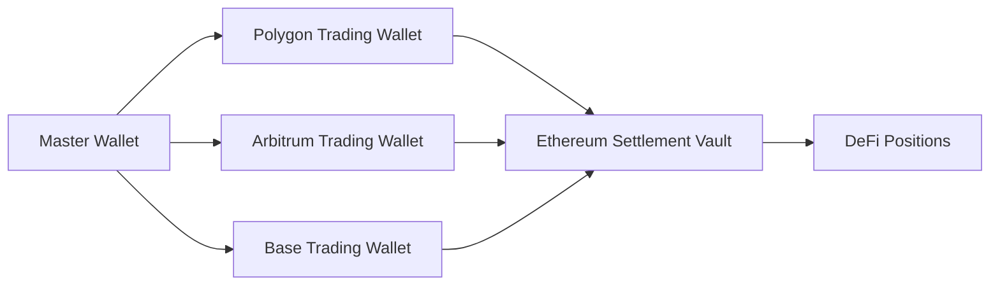

# Deploy Your First Multi-Chain Agent

Get started with c0gni in under 60 seconds. This guide will walk you through deploying a Cross-Chain Arbitrage agent that finds price differences across EVM chains and rotates profits to Ethereum DeFi.

<Info>
**Prerequisites:**
- MetaMask or any EVM-compatible wallet
- 0.1-1 ETH worth of tokens (ETH, MATIC, ARB, or USDC)
- Basic understanding of DeFi concepts
</Info>

## Step 1: Connect Your Wallet

<Steps>
  <Step title="Visit the Platform">
    Go to [app.cognilabs.com](https://app.cognilabs.com) and click "Connect Wallet"
  </Step>
  <Step title="Select Network">
    Choose your starting chain (Ethereum, Polygon, Arbitrum, Base, or BSC)
  </Step>
  <Step title="Approve Connection">
    Confirm the connection in MetaMask
  </Step>
</Steps>

<Warning>
Never share your private keys or seed phrase. c0gni only requires standard wallet connection permissions.
</Warning>

## Step 2: Choose Agent Blueprint

Navigate to the **Agent Factory** and select from multi-chain optimized blueprints:

<CardGroup cols={2}>
  <Card title="Cross-Chain Arbitrage" icon="arrows-left-right">
    **Best for steady returns**
    
    Finds price differences between DEXs across different chains and executes profitable trades.
    
    - Risk Level: Low-Medium
    - Success Rate: 89%
    - Avg ROI: 0.5-2% daily
    - Chains: All EVM
  </Card>
  
  <Card title="DeFi Yield Farmer" icon="wheat">
    **Best for passive income**
    
    Automatically farms yield across Aave, Compound, Curve on multiple chains.
    
    - Risk Level: Low
    - APY: 8-15%
    - Auto-compounds: Yes
    - Chains: ETH, Polygon, Arbitrum
  </Card>
</CardGroup>

<CardGroup cols={2}>
  <Card title="Multi-Chain Sniper" icon="crosshairs">
    **Best for high returns**
    
    Detects new token launches across all chains and executes early entry trades.
    
    - Risk Level: High
    - Success Rate: 65%
    - Avg ROI: 5-50x
    - Chains: All EVM
  </Card>
  
  <Card title="Liquidity Optimizer" icon="chart-line">
    **Best for LPs**
    
    Manages liquidity positions across Uniswap V3, Curve, and Balancer for optimal fees.
    
    - Risk Level: Medium
    - APY: 15-40%
    - IL Protection: Yes
    - Chains: ETH, Arbitrum
  </Card>
</CardGroup>

## Step 3: Configure Multi-Chain Settings

### Chain Selection

```json
{
  "executionChains": ["polygon", "arbitrum", "base"],
  "settlementChain": "ethereum",
  "bridgeStrategy": "weekly",
  "gasOptimization": "aggressive"
}
```

<Tabs>
  <Tab title="Execution Chains">
    <AccordionGroup>
      <Accordion title="Polygon (MATIC)">
        - Gas Cost: <$0.01 per transaction
        - Block Time: 2 seconds
        - Best For: High-frequency trading, small trades
      </Accordion>
      
      <Accordion title="Arbitrum">
        - Gas Cost: $0.01-0.05 per transaction
        - Block Time: ~250ms
        - Best For: DeFi interactions, complex strategies
      </Accordion>
      
      <Accordion title="Base">
        - Gas Cost: <$0.01 per transaction
        - Block Time: 2 seconds
        - Best For: New token launches, meme coins
      </Accordion>
      
      <Accordion title="BSC">
        - Gas Cost: $0.05-0.15 per transaction
        - Block Time: 3 seconds
        - Best For: PancakeSwap trades, yield farming
      </Accordion>
    </AccordionGroup>
  </Tab>
  
  <Tab title="Settlement Strategy">
    <AccordionGroup>
      <Accordion title="Ethereum DeFi Allocation">
        Configure how profits are deployed on Ethereum:
        - **Aave**: 30% - Lending for stable 3-5% APY
        - **Compound**: 20% - Interest generation
        - **Curve**: 30% - Stablecoin yields (8-12% APY)
        - **Convex**: 20% - Boosted CRV rewards
      </Accordion>
      
      <Accordion title="Bridge Timing">
        - **Daily**: For high-volume traders ($10k+ daily)
        - **Weekly**: Optimal gas efficiency (recommended)
        - **Monthly**: For long-term accumulation
        - **Threshold**: Bridge when profits exceed 0.1 ETH
      </Accordion>
      
      <Accordion title="Risk Parameters">
        - Maximum position size: 10% of portfolio per trade
        - Stop loss: -5% per position
        - Daily loss limit: -10% of portfolio
        - Slippage tolerance: 1-3% depending on chain
      </Accordion>
    </AccordionGroup>
  </Tab>
  
  <Tab title="Advanced Settings">
    <AccordionGroup>
      <Accordion title="MEV Protection">
        Enable Flashbots Protect for Ethereum transactions (recommended: ON)
      </Accordion>
      
      <Accordion title="Cross-Chain Routing">
        - Use 1inch for aggregation
        - Paraswap for backup routing
        - Direct DEX integration when optimal
      </Accordion>
      
      <Accordion title="Gas Optimization">
        - **Conservative**: Wait for low gas periods
        - **Standard**: Execute within reasonable limits
        - **Aggressive**: Prioritize speed over cost
      </Accordion>
    </AccordionGroup>
  </Tab>
</Tabs>

## Step 4: Fund Your Agent

<Steps>
  <Step title="Choose Funding Method">
    - **Direct Transfer**: Send ETH/MATIC/ARB to agent wallet
    - **Cross-Chain**: Bridge from any supported chain
    - **Stablecoin**: Fund with USDC/USDT/DAI
  </Step>
  <Step title="Set Budget Allocation">
    - Trading Capital: 70% - Active trading on L2s
    - Reserve: 20% - Gas and bridge fees
    - DeFi Allocation: 10% - Initial Ethereum positions
  </Step>
  <Step title="Confirm Funding">
    Review gas estimates and approve transaction in MetaMask
  </Step>
  <Step title="Activate Agent">
    Agent begins monitoring all configured chains immediately
  </Step>
</Steps>

### Multi-Chain Wallet Architecture



## Step 5: Monitor Cross-Chain Performance

Your agent is now active across multiple chains! Monitor its performance through the unified dashboard:

### Real-Time Analytics

<Info>
**Multi-Chain Dashboard Features:**
- Combined P&L across all chains
- Gas costs per chain breakdown
- Bridge transaction history
- DeFi position tracking
- APY calculations with auto-compounding
</Info>

### Key Metrics by Chain

| Chain | Avg Gas Cost | Trades/Day | Success Rate | ROI |
|-------|--------------|------------|--------------|-----|
| **Polygon** | $0.005 | 50-200 | 92% | 0.3-1% |
| **Arbitrum** | $0.03 | 20-100 | 88% | 0.5-1.5% |
| **Base** | $0.008 | 30-150 | 85% | 0.4-2% |
| **Ethereum** | $15-50 | 1-5 (settlements) | 95% | 5-15% APY |

## What Happens Next?

Your multi-chain agent will now:

1. **Monitor all chains** simultaneously for arbitrage opportunities
2. **Execute trades** on the most profitable chain with lowest gas
3. **Accumulate profits** in stablecoins on each chain
4. **Bridge weekly** to Ethereum when gas is optimal
5. **Deploy to DeFi** automatically for compound yields
6. **Rebalance monthly** to optimize APY

<Tip>
**Pro Tips for Multi-Chain Success:**
- Start with 2-3 chains to understand the dynamics
- Keep 0.1 ETH on Ethereum for settlement gas
- Enable auto-compounding for maximum returns
- Monitor bridge costs vs. profit ratios
</Tip>

## Example Strategy: Cross-Chain Arbitrage

<Steps>
  <Step title="Detection">
    Agent detects USDC/USDT price: 0.998 on Polygon, 1.002 on Arbitrum
  </Step>
  <Step title="Execution">
    Buy USDT with 10,000 USDC on Polygon ($0.005 gas)
  </Step>
  <Step title="Bridge">
    Use Synapse to bridge USDT to Arbitrum ($2 fee)
  </Step>
  <Step title="Profit">
    Sell USDT for USDC on Arbitrum: 10,040 USDC ($0.03 gas)
    Net profit: ~$38 (0.38% return)
  </Step>
  <Step title="Compound">
    Weekly bridge to Ethereum, deposit in Curve 3pool for 8% APY
  </Step>
</Steps>

## Next Steps

<CardGroup cols={2}>
  <Card title="Chain Analysis" icon="chart-mixed" href="/guides/chain-selection">
    Learn which chains are best for different strategies
  </Card>
  
  <Card title="DeFi Strategies" icon="coins" href="/guides/defi-optimization">
    Maximize yields with advanced DeFi strategies
  </Card>
  
  <Card title="Bridge Optimization" icon="bridge" href="/guides/bridge-strategies">
    Minimize costs when moving between chains
  </Card>
  
  <Card title="Risk Management" icon="shield-check" href="/guides/multi-chain-risk">
    Protect your capital across multiple chains
  </Card>
</CardGroup>

## Troubleshooting

<AccordionGroup>
  <Accordion title="MetaMask not connecting">
    **Common causes:**
    - Wrong network selected
    - Insufficient ETH for gas
    - Browser extension conflicts
    
    **Solution:** Switch to Ethereum mainnet, ensure you have ETH, disable other wallet extensions
  </Accordion>
  
  <Accordion title="High gas fees on Ethereum">
    **Strategy:**
    - Execute trades on L2s only
    - Bridge during weekend low-gas periods
    - Batch multiple profits before bridging
    
    **Tools:** Use [gasNow](https://gasnow.org) to monitor gas prices
  </Accordion>
  
  <Accordion title="Bridge transaction stuck">
    **Steps:**
    - Check bridge explorer for status
    - May take 10-30 minutes for finality
    - Contact bridge support if >1 hour
    
    **Prevention:** Always use reputable bridges with insurance
  </Accordion>
</AccordionGroup>

<Card title="Need Help?" icon="life-ring" href="/support/discord">
  Join our Discord for 24/7 community support and strategy discussions
</Card>