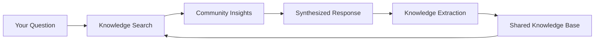

# Join the Collective Intelligence Network

Get started with c0gni in under 60 seconds. This guide will walk you through accessing shared crypto knowledge, exploring the visual knowledge graph, and contributing to collective intelligence.

<Info>
**No Prerequisites Needed:**
- Start chatting immediately - no wallet required for basic access
- No tokens needed - free access to collective intelligence  
- No crypto experience required - learn from the community
</Info>

## Step 1: Start Your First Conversation

<Steps>
  <Step title="Visit the Platform">
    Go to [c0gnilabs.xyz](https://c0gnilabs.xyz) and start chatting immediately
  </Step>
  <Step title="Ask Any Crypto Question">
    Try: "What's the safest DeFi protocol for earning yield?" or "Explain Uniswap V3"
  </Step>
  <Step title="Get Instant Intelligence">
    Receive insights from thousands of previous conversations in <30ms
  </Step>
</Steps>

<Tip>
Your questions help build collective intelligence. Every conversation makes the network smarter for everyone.
</Tip>

## Step 2: Explore the Knowledge Graph

Navigate to the **Visual Knowledge Explorer** to see collective intelligence in action:

<CardGroup cols={2}>
  <Card title="Token Connections" icon="network-wired">
    **See How Tokens Relate**
    
    Visualize connections between cryptocurrencies, their protocols, and trading patterns discovered by the community.
    
    - Interactive visualization
    - Real-time updates  
    - Pattern discovery
    - Risk relationships
  </Card>
  
  <Card title="DeFi Protocol Map" icon="coins">
    **Protocol Intelligence**
    
    Explore how DeFi protocols connect, their yields, risks, and user experiences from thousands of conversations.
    
    - Yield comparisons
    - Risk assessments
    - User experiences
    - Protocol relationships
  </Card>
</CardGroup>

<CardGroup cols={2}>
  <Card title="Trading Strategies" icon="trending-up">
    **Community Wisdom**
    
    Access validated trading strategies, risk patterns, and market insights discovered by the collective network.
    
    - Validated approaches
    - Risk assessments
    - Success patterns
    - Community insights
  </Card>
  
  <Card title="Market Intelligence" icon="brain">
    **Collective Analysis**
    
    Tap into aggregated market intelligence, sentiment analysis, and trend identification from network conversations.
    
    - Market trends
    - Sentiment analysis
    - Pattern recognition
    - Collective predictions
  </Card>
</CardGroup>

## Step 3: Understand How Knowledge Grows

### Intelligence Categories

The c0gni network captures and organizes crypto intelligence across multiple categories:

```json
{
  "tokenData": "Prices, volumes, market caps, trading patterns",
  "defiProtocols": "Yields, TVL, risks, user experiences", 
  "tradingStrategies": "Validated approaches, success rates",
  "marketAnalysis": "Trends, correlations, sentiment patterns"
}
```

<Tabs>
  <Tab title="Knowledge Types">
    <AccordionGroup>
      <Accordion title="Token Intelligence">
        - **Price Data**: Current prices, 24h changes, volume patterns
        - **Risk Assessment**: Community-validated safety ratings  
        - **Trading Patterns**: Successful entry/exit strategies
        - **Protocol Integration**: How tokens work with DeFi
      </Accordion>
      
      <Accordion title="DeFi Protocols">
        - **Yield Data**: APY rates, historical performance
        - **Risk Levels**: Smart contract risks, impermanent loss
        - **User Experiences**: Real feedback from community
        - **Integration Strategies**: How to optimize usage
      </Accordion>
      
      <Accordion title="Market Analysis">
        - **Trend Recognition**: Patterns from thousands of conversations
        - **Correlation Analysis**: How different assets relate
        - **Sentiment Patterns**: Community mood and confidence
        - **Timing Intelligence**: When to enter/exit positions
      </Accordion>
      
      <Accordion title="Trading Strategies">
        - **Validated Approaches**: Community-tested methods
        - **Risk Management**: Proven protection strategies
        - **Success Metrics**: Performance data from users
        - **Timing Optimization**: Best practices for execution
      </Accordion>
    </AccordionGroup>
  </Tab>
  
  <Tab title="Intelligence Quality">
    <AccordionGroup>
      <Accordion title="Collective Validation">
        - **Community Verification**: Multiple users confirm insights
        - **Pattern Matching**: Cross-reference similar situations
        - **Confidence Scoring**: Rate reliability of information
        - **Real-Time Updates**: Knowledge stays current
      </Accordion>
      
      <Accordion title="Source Diversity">
        - **Multi-User Input**: Insights from various perspectives
        - **Cross-Chain Data**: Information from all networks
        - **Historical Patterns**: Learn from past market cycles
        - **Live Market Data**: Real-time scanner feeds
      </Accordion>
      
      <Accordion title="Knowledge Growth">
        - **Continuous Learning**: Network improves with each conversation
        - **Pattern Evolution**: Strategies adapt to market changes
        - **Community Curation**: Users validate and improve insights
        - **Network Effects**: More users = better intelligence
      </Accordion>
    </AccordionGroup>
  </Tab>
  
  <Tab title="Access Levels">
    <AccordionGroup>
      <Accordion title="Free Access">
        - Basic chat functionality and knowledge access
        - View knowledge graph (limited interactions)
        - Standard response times
        - Community insights access
      </Accordion>
      
      <Accordion title="COGNI Holders">
        - Unlimited queries and faster responses
        - Full knowledge graph interaction
        - Custom knowledge clusters
        - Priority access to new features
      </Accordion>
      
      <Accordion title="Stakers & Premium">
        - Agent swarm connections
        - Private knowledge repositories  
        - Advanced pattern analysis
        - Early access to scanner alerts
        - Governance participation
      </Accordion>
    </AccordionGroup>
  </Tab>
</Tabs>

## Step 4: Contribute to Collective Intelligence

<Steps>
  <Step title="Ask Thoughtful Questions">
    - **Specific Inquiries**: "What are the risks of yield farming on Curve?"
    - **Comparative Analysis**: "Compare Aave vs Compound for USDC lending"
    - **Strategy Questions**: "Best approach for DeFi portfolio diversification?"
  </Step>
  <Step title="Share Your Experience">
    - **Protocol Feedback**: Share your experiences with DeFi protocols
    - **Market Observations**: Discuss trends you've noticed
    - **Risk Insights**: Alert others to potential risks you've discovered
  </Step>
  <Step title="Validate Community Insights">
    - **Verify Information**: Confirm or correct insights from others
    - **Add Context**: Provide additional details to existing knowledge
    - **Pattern Recognition**: Help identify emerging trends
  </Step>
  <Step title="Watch Knowledge Grow">
    - **Real-Time Updates**: See the knowledge graph expand
    - **Pattern Emergence**: Observe collective insights forming
    - **Network Benefits**: Experience improved responses over time
  </Step>
</Steps>

### Collective Intelligence Flow



## Step 5: Explore Advanced Features

Now that you're part of the collective intelligence network, discover advanced capabilities:

### Intelligence Analytics

<Info>
**Knowledge Network Features:**
- Visual knowledge graph with real-time updates
- Pattern recognition across thousands of conversations
- Community validation of insights and strategies
- Personalized intelligence based on your interests
- Contribution tracking and network reputation
</Info>

### Intelligence Quality Metrics

| Knowledge Type | Sources | Validation Rate | Confidence Score | Update Frequency |
|----------------|---------|-----------------|------------------|------------------|
| **Token Data** | 1000+ users | 94% | 0.91 | Real-time |
| **DeFi Protocols** | 500+ experiences | 96% | 0.93 | Daily |
| **Trading Strategies** | 200+ validated | 89% | 0.87 | Weekly |
| **Market Analysis** | Network-wide | 92% | 0.90 | Continuous |

## What Happens Next?

As part of the collective intelligence network, you'll experience:

1. **Continuous Learning** - Every conversation improves the knowledge base
2. **Pattern Recognition** - Discover trends across thousands of interactions
3. **Community Validation** - See your insights verified by others
4. **Network Growth** - Benefit from exponential knowledge accumulation
5. **Intelligence Evolution** - Watch the system get smarter over time
6. **Personal Growth** - Improve your crypto knowledge through collective wisdom

<Tip>
**Pro Tips for Maximum Value:**
- Ask specific, detailed questions for better insights
- Share your experiences to help validate community knowledge
- Explore the visual knowledge graph regularly to discover connections
- Contribute quality insights to earn network reputation
</Tip>

## Example: Collective Intelligence in Action

<Steps>
  <Step title="User Question">
    "What are the current yields for stablecoin farming on different protocols?"
  </Step>
  <Step title="Knowledge Search">
    System searches collective database for yield data, risks, and user experiences
  </Step>
  <Step title="Insight Synthesis">
    Combines data from hundreds of conversations about Aave, Compound, Curve yields
  </Step>
  <Step title="Community Validation">
    Response includes confidence scores based on multiple user confirmations
  </Step>
  <Step title="Knowledge Extraction">
    User's question and the response get extracted and added to shared intelligence
  </Step>
</Steps>

## Next Steps

<CardGroup cols={2}>
  <Card title="Explore Knowledge Graph" icon="network" href="/knowledge-graph">
    Visualize connections between tokens, protocols, and strategies
  </Card>
  
  <Card title="Understand Collective Intelligence" icon="brain" href="/collective-intelligence">
    Learn how shared knowledge creates exponential value
  </Card>
  
  <Card title="Join Agent Network" icon="users" href="/agents/overview">
    Connect with specialized knowledge agents
  </Card>
  
  <Card title="Access Premium Features" icon="star" href="/token-overview">
    Stake COGNI for advanced intelligence tools
  </Card>
</CardGroup>

## Troubleshooting

<AccordionGroup>
  <Accordion title="Knowledge graph not loading">
    **Common causes:**
    - Browser compatibility issues
    - Too many nodes to display
    - Network connection problems
    
    **Solution:** Try refreshing the page, use Chrome/Firefox, or reduce the knowledge filter scope
  </Accordion>
  
  <Accordion title="Slow response times">
    **Optimization:**
    - Network congestion during peak times
    - Complex queries requiring more processing
    - Large knowledge base searches
    
    **Tips:** Try more specific questions, or consider upgrading to COGNI holder access for priority responses
  </Accordion>
  
  <Accordion title="Limited access to features">
    **Access Tiers:**
    - Free users have basic chat and viewing
    - COGNI holders get unlimited queries and full features
    - Stakers access premium intelligence tools
    
    **Solution:** Connect wallet and hold/stake COGNI tokens for enhanced access
  </Accordion>
</AccordionGroup>

<Card title="Need Help?" icon="life-ring" href="/support/discord">
  Join our Discord community to share insights and learn from collective intelligence
</Card>