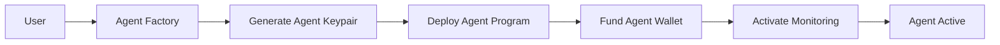

# Deploy Your First Agent

Get started with c0gni in under 60 seconds. This guide will walk you through deploying a Sniper agent that automatically detects and trades new token launches.

<Info>
**Prerequisites:**
- Phantom, Solflare, or compatible Solana wallet
- 0.5-10 SOL for agent funding
- Basic understanding of trading concepts
</Info>

## Step 1: Connect Your Wallet

<Steps>
  <Step title="Visit the Platform">
    Go to [app.cognilabs.com](https://app.cognilabs.com) and click "Connect Wallet"
  </Step>
  <Step title="Select Wallet">
    Choose your preferred Solana wallet (Phantom, Solflare, etc.)
  </Step>
  <Step title="Approve Connection">
    Confirm the connection in your wallet extension
  </Step>
</Steps>

<Warning>
Never share your private keys. c0gni only needs wallet connection permissions to deploy and fund agents.
</Warning>

## Step 2: Choose Agent Blueprint

Navigate to the **Agent Factory** and select from pre-configured blueprints:

<CardGroup cols={2}>
  <Card title="Sniper Agent" icon="crosshairs">
    **Best for beginners**
    
    Detects new token launches and executes entry trades within milliseconds.
    
    - Risk Level: Medium
    - Success Rate: 73%
    - Avg ROI: 2.3x
  </Card>
  
  <Card title="Arbitrage Engine" icon="arrows-left-right">
    **Steady returns**
    
    Finds price differences across DEXs and executes profitable arbitrage trades.
    
    - Risk Level: Low
    - Success Rate: 94%
    - Avg ROI: 1.2x
  </Card>
</CardGroup>

<CardGroup cols={2}>
  <Card title="LP Optimizer" icon="chart-line">
    **Long-term growth**
    
    Automatically manages liquidity positions for optimal fee generation.
    
    - Risk Level: Low
    - Success Rate: 89%
    - Avg ROI: 15% APY
  </Card>
  
  <Card title="Custom Agent" icon="code">
    **For developers**
    
    Build your own strategy using our SDK and deploy as an autonomous agent.
    
    - Risk Level: Variable
    - Success Rate: Variable
    - ROI: Your strategy
  </Card>
</CardGroup>

## Step 3: Configure Agent Settings

### Basic Configuration

```json
{
  "agentType": "sniper",
  "budget": "2.5 SOL",
  "riskLevel": "medium",
  "autoExit": true
}
```

<Tabs>
  <Tab title="Budget & Risk">
    <AccordionGroup>
      <Accordion title="Initial Budget">
        Set the amount of SOL your agent can use for trading (0.5-10 SOL recommended for first deployment)
      </Accordion>
      
      <Accordion title="Risk Level">
        - **Conservative**: Lower risk, slower returns
        - **Balanced**: Medium risk for moderate gains  
        - **Aggressive**: Higher risk for maximum alpha
      </Accordion>
      
      <Accordion title="Position Sizing">
        Maximum percentage of budget per trade (default: 20%)
      </Accordion>
    </AccordionGroup>
  </Tab>
  
  <Tab title="Auto-Exit Rules">
    <AccordionGroup>
      <Accordion title="Take Profit">
        Automatically sell when profit reaches target (default: 100%)
      </Accordion>
      
      <Accordion title="Stop Loss">
        Exit position when loss reaches threshold (default: -30%)
      </Accordion>
      
      <Accordion title="Time Limits">
        Maximum time to hold a position (default: 30 minutes)
      </Accordion>
    </AccordionGroup>
  </Tab>
  
  <Tab title="Advanced Settings">
    <AccordionGroup>
      <Accordion title="MEV Protection">
        Enable Jito bundle protection against frontrunning (recommended: ON)
      </Accordion>
      
      <Accordion title="Slippage Tolerance">
        Maximum acceptable slippage for trades (default: 5%)
      </Accordion>
      
      <Accordion title="Priority Fees">
        Extra fees for faster transaction confirmation (default: AUTO)
      </Accordion>
    </AccordionGroup>
  </Tab>
</Tabs>

## Step 4: Deploy Agent

<Steps>
  <Step title="Review Configuration">
    Double-check your settings and budget allocation
  </Step>
  <Step title="Fund Agent Wallet">
    Transfer SOL to your agent's dedicated wallet address
  </Step>
  <Step title="Deploy">
    Click "Deploy Agent" and confirm the transaction
  </Step>
  <Step title="Activate">
    Your agent will begin monitoring for opportunities immediately
  </Step>
</Steps>

### Transaction Flow



## Step 5: Monitor Performance

Your agent is now active! Monitor its performance through the dashboard:

### Real-Time Metrics

<Info>
**Live Dashboard Features:**
- Trade execution history
- Current positions and PnL
- Risk metrics and exposure  
- Agent decision logs
- Performance analytics
</Info>

### Key Metrics to Watch

| Metric | Description | Good Performance |
|--------|-------------|------------------|
| **Success Rate** | Percentage of profitable trades | >70% |
| **Avg ROI** | Average return on investment | >50% |
| **Max Drawdown** | Largest loss from peak | <20% |
| **Execution Speed** | Time from signal to execution | <400ms |

## What Happens Next?

Your agent will now:

1. **Monitor markets** 24/7 for opportunities matching its strategy
2. **Execute trades** automatically when conditions are met
3. **Learn from results** to improve future performance
4. **Report activity** through the dashboard and notifications

<Tip>
**Pro Tip:** Start with a smaller budget (0.5-1 SOL) to get familiar with how your agent behaves before scaling up.
</Tip>

## Next Steps

<CardGroup cols={2}>
  <Card title="Dashboard Walkthrough" icon="chart-mixed" href="/guides/dashboard-walkthrough">
    Learn to navigate and interpret your agent's performance
  </Card>
  
  <Card title="Risk Management" icon="shield-check" href="/guides/risk-management">
    Set up advanced safety controls and alerts
  </Card>
  
  <Card title="Agent Types" icon="robot" href="/agents/types">
    Explore different agent specializations and strategies
  </Card>
  
  <Card title="SDK Development" icon="code" href="/sdk/introduction">
    Build custom agents with our Python/TypeScript SDK
  </Card>
</CardGroup>

## Troubleshooting

<AccordionGroup>
  <Accordion title="Agent not deploying">
    **Common causes:**
    - Insufficient SOL for deployment fees (~0.01 SOL)
    - Wallet connection issues
    - Network congestion
    
    **Solution:** Check wallet balance and try reconnecting
  </Accordion>
  
  <Accordion title="No trading activity">
    **Possible reasons:**
    - Market conditions don't match strategy criteria
    - Risk parameters too conservative
    - Insufficient liquidity in target tokens
    
    **Solution:** Review strategy settings or try different agent type
  </Accordion>
  
  <Accordion title="High losses">
    **Safety measures:**
    - Activate stop-loss protection
    - Reduce position sizing
    - Switch to conservative risk mode
    
    **Remember:** All trading involves risk. Never invest more than you can afford to lose.
  </Accordion>
</AccordionGroup>

<Card title="Need Help?" icon="life-ring" href="/support/troubleshooting">
  Check our full troubleshooting guide or join the Discord community
</Card>