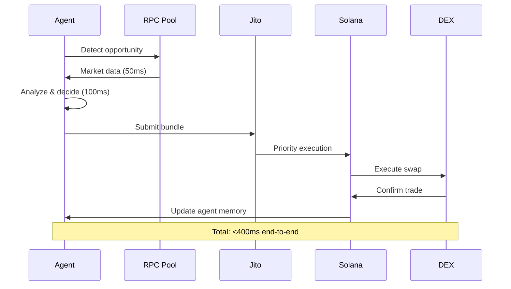

# Solana Integration

c0gni is built natively on Solana to leverage its high-performance, low-cost infrastructure for autonomous agent operations. Our deep integration enables sub-400ms execution times and persistent on-chain agent memory.

## Why Solana?

<CardGroup cols={2}>
  <Card title="High Performance" icon="zap">
    **400ms Block Times**
    
    Solana's fast consensus enables near-instant trade execution critical for automated trading
  </Card>
  
  <Card title="Low Costs" icon="dollar-sign">
    **~$0.00025 per Transaction**
    
    Minimal fees allow micro-trades and frequent agent state updates
  </Card>
  
  <Card title="Parallel Execution" icon="cpu">
    **50,000+ TPS Capability**
    
    Simultaneous agent operations without network congestion
  </Card>
  
  <Card title="Native Programs" icon="code">
    **Custom Smart Contracts**
    
    Purpose-built programs for agent memory and coordination
  </Card>
</CardGroup>

## Core Solana Programs

### Agent Memory Program

```rust
use anchor_lang::prelude::*;

#[program]
pub mod agent_memory {
    use super::*;
    
    pub fn initialize_agent(
        ctx: Context<InitializeAgent>,
        agent_type: AgentType,
        owner: Pubkey,
        initial_config: AgentConfig,
    ) -> Result<()> {
        let agent_account = &mut ctx.accounts.agent_account;
        
        agent_account.owner = owner;
        agent_account.agent_type = agent_type;
        agent_account.config = initial_config;
        agent_account.created_at = Clock::get()?.unix_timestamp;
        agent_account.status = AgentStatus::Active;
        agent_account.trade_count = 0;
        agent_account.total_pnl = 0;
        
        Ok(())
    }
    
    pub fn update_agent_memory(
        ctx: Context<UpdateMemory>,
        trade_record: TradeRecord,
        learned_patterns: Vec<Pattern>,
    ) -> Result<()> {
        let agent_account = &mut ctx.accounts.agent_account;
        
        // Add trade to history
        agent_account.add_trade_record(trade_record)?;
        
        // Update learned patterns
        agent_account.update_patterns(learned_patterns)?;
        
        // Update performance metrics
        agent_account.recalculate_metrics()?;
        
        agent_account.last_updated = Clock::get()?.unix_timestamp;
        
        emit!(AgentMemoryUpdated {
            agent: agent_account.key(),
            trade_count: agent_account.trade_count,
            total_pnl: agent_account.total_pnl,
        });
        
        Ok(())
    }
}

#[account]
pub struct AgentAccount {
    pub owner: Pubkey,
    pub agent_type: AgentType,
    pub config: AgentConfig,
    pub status: AgentStatus,
    pub created_at: i64,
    pub last_updated: i64,
    
    // Trading data
    pub trade_count: u64,
    pub successful_trades: u64,
    pub total_pnl: i64,
    pub max_drawdown: i64,
    
    // Learning data
    pub trade_history: Vec<TradeRecord>,
    pub learned_patterns: Vec<Pattern>,
    pub performance_metrics: PerformanceData,
    
    // Risk parameters
    pub risk_config: RiskConfig,
}
```

### Swarm Coordination Program

```rust
#[program]
pub mod swarm_coordinator {
    use super::*;
    
    pub fn create_swarm(
        ctx: Context<CreateSwarm>,
        swarm_id: [u8; 32],
        coordinator: Pubkey,
        member_agents: Vec<Pubkey>,
    ) -> Result<()> {
        let swarm_account = &mut ctx.accounts.swarm_account;
        
        swarm_account.swarm_id = swarm_id;
        swarm_account.coordinator = coordinator;
        swarm_account.members = member_agents;
        swarm_account.created_at = Clock::get()?.unix_timestamp;
        swarm_account.status = SwarmStatus::Active;
        
        // Initialize consensus tracking
        swarm_account.consensus_threshold = 0.6; // 60% agreement required
        swarm_account.active_proposals = Vec::new();
        
        Ok(())
    }
    
    pub fn submit_proposal(
        ctx: Context<SubmitProposal>,
        proposal: SwarmProposal,
    ) -> Result<()> {
        let swarm_account = &mut ctx.accounts.swarm_account;
        
        // Verify sender is swarm member
        require!(
            swarm_account.members.contains(&ctx.accounts.proposer.key()),
            SwarmError::NotMember
        );
        
        // Add proposal to active list
        swarm_account.active_proposals.push(proposal);
        
        emit!(ProposalSubmitted {
            swarm: swarm_account.key(),
            proposer: ctx.accounts.proposer.key(),
            proposal_id: proposal.id,
        });
        
        Ok(())
    }
    
    pub fn vote_on_proposal(
        ctx: Context<VoteProposal>,
        proposal_id: [u8; 32],
        vote: Vote,
    ) -> Result<()> {
        let swarm_account = &mut ctx.accounts.swarm_account;
        
        // Find and update proposal
        if let Some(proposal) = swarm_account.find_proposal_mut(proposal_id) {
            proposal.add_vote(ctx.accounts.voter.key(), vote)?;
            
            // Check if consensus reached
            if proposal.consensus_reached(swarm_account.consensus_threshold) {
                swarm_account.execute_proposal(proposal)?;
            }
        }
        
        Ok(())
    }
}
```

## Transaction Execution Architecture

### High-Speed Trading Pipeline



### RPC Infrastructure

<Tabs>
  <Tab title="Connection Pooling">
    **Optimized RPC Management**
    
    ```typescript
    class SolanaRPCManager {
      private pools: Map<string, ConnectionPool> = new Map();
      
      constructor() {
        // Initialize multiple RPC endpoints
        this.initializePools([
          { url: 'https://api.mainnet-beta.solana.com', weight: 3 },
          { url: 'https://solana-api.projectserum.com', weight: 2 },
          { url: 'https://rpc.ankr.com/solana', weight: 1 },
        ]);
      }
      
      async getConnection(): Promise<Connection> {
        // Smart load balancing based on latency
        const bestPool = await this.selectBestPool();
        return bestPool.getConnection();
      }
      
      private async selectBestPool(): Promise<ConnectionPool> {
        const healthChecks = await Promise.all(
          Array.from(this.pools.values()).map(pool => ({
            pool,
            latency: await pool.checkLatency(),
            load: pool.getCurrentLoad()
          }))
        );
        
        // Select pool with best latency/load ratio
        return healthChecks
          .filter(check => check.latency < 200) // Max 200ms latency
          .sort((a, b) => (a.latency * a.load) - (b.latency * b.load))[0].pool;
      }
    }
    ```
  </Tab>
  
  <Tab title="Transaction Building">
    **Optimized Transaction Construction**
    
    ```typescript
    interface TradeInstruction {
      programId: PublicKey;
      accounts: AccountMeta[];
      data: Buffer;
    }
    
    class TransactionBuilder {
      private instructions: TradeInstruction[] = [];
      private recentBlockhash: string;
      private feePayer: PublicKey;
      
      addSwapInstruction(
        tokenIn: PublicKey,
        tokenOut: PublicKey, 
        amount: number,
        slippage: number
      ): this {
        // Build Jupiter swap instruction
        const swapIx = this.buildJupiterSwap({
          tokenIn,
          tokenOut,
          amount,
          slippageBps: slippage * 100
        });
        
        this.instructions.push(swapIx);
        return this;
      }
      
      addMemoryUpdateInstruction(
        agentAccount: PublicKey,
        tradeData: TradeRecord
      ): this {
        // Update agent memory after trade
        const memoryIx = this.buildMemoryUpdate(agentAccount, tradeData);
        this.instructions.push(memoryIx);
        return this;
      }
      
      async build(): Promise<Transaction> {
        const transaction = new Transaction();
        
        // Set recent blockhash for fast confirmation
        transaction.recentBlockhash = await this.getRecentBlockhash();
        transaction.feePayer = this.feePayer;
        
        // Add all instructions
        this.instructions.forEach(ix => transaction.add(ix));
        
        // Optimize transaction size
        return this.optimizeTransaction(transaction);
      }
    }
    ```
  </Tab>
  
  <Tab title="Priority Fees">
    **Dynamic Fee Optimization**
    
    ```python
    class PriorityFeeManager:
        def __init__(self, rpc_client):
            self.rpc = rpc_client
            self.fee_history = []
            
        async def calculate_optimal_fee(self, urgency: str = 'medium') -> int:
            """Calculate optimal priority fee based on network conditions"""
            
            # Get recent fee data
            recent_fees = await self.get_recent_priority_fees()
            network_congestion = await self.assess_network_congestion()
            
            # Base fee calculation
            if urgency == 'low':
                multiplier = 0.5
            elif urgency == 'medium': 
                multiplier = 1.0
            elif urgency == 'high':
                multiplier = 2.0
            else:  # 'maximum'
                multiplier = 5.0
            
            # Adjust for network conditions
            if network_congestion > 0.8:  # High congestion
                multiplier *= 1.5
            elif network_congestion < 0.3:  # Low congestion
                multiplier *= 0.7
                
            optimal_fee = int(recent_fees.median * multiplier)
            
            # Cap at reasonable maximum
            return min(optimal_fee, 10000)  # Max 0.01 SOL
    ```
  </Tab>
</Tabs>

## On-Chain Agent State Management

### State Persistence

<AccordionGroup>
  <Accordion title="Memory Serialization">
    **Efficient State Storage**
    
    ```rust
    use borsh::{BorshDeserialize, BorshSerialize};
    
    #[derive(BorshSerialize, BorshDeserialize, Debug)]
    pub struct CompressedAgentState {
        pub version: u8,
        pub compressed_trades: Vec<u8>,       // LZ4 compressed trade history
        pub pattern_hashes: Vec<[u8; 32]>,    // Hash references to patterns
        pub metrics_summary: MetricsSummary,  // Essential metrics only
    }
    
    impl AgentAccount {
        pub fn compress_state(&self) -> Result<CompressedAgentState> {
            let trade_bytes = borsh::to_vec(&self.trade_history)?;
            let compressed_trades = lz4::compress(&trade_bytes)?;
            
            let pattern_hashes = self.learned_patterns
                .iter()
                .map(|p| self.hash_pattern(p))
                .collect();
                
            Ok(CompressedAgentState {
                version: 1,
                compressed_trades,
                pattern_hashes,
                metrics_summary: self.create_metrics_summary(),
            })
        }
        
        pub fn decompress_state(&mut self, state: CompressedAgentState) -> Result<()> {
            let trade_bytes = lz4::decompress(&state.compressed_trades)?;
            self.trade_history = borsh::from_slice(&trade_bytes)?;
            
            // Lazy load patterns on demand
            self.pattern_cache = Some(PatternCache::new(state.pattern_hashes));
            
            Ok(())
        }
    }
    ```
  </Accordion>
  
  <Accordion title="State Synchronization">
    **Multi-Agent Coordination**
    
    ```rust
    #[derive(Accounts)]
    pub struct SynchronizeStates<'info> {
        #[account(mut)]
        pub agent_a: Account<'info, AgentAccount>,
        
        #[account(mut)]
        pub agent_b: Account<'info, AgentAccount>,
        
        #[account(mut)]
        pub swarm_account: Account<'info, SwarmAccount>,
        
        #[account(signer)]
        pub coordinator: Signer<'info>,
    }
    
    pub fn synchronize_agent_states(
        ctx: Context<SynchronizeStates>,
        sync_data: StateSyncData,
    ) -> Result<()> {
        let agent_a = &mut ctx.accounts.agent_a;
        let agent_b = &mut ctx.accounts.agent_b;
        
        // Share successful patterns between agents
        let patterns_to_share = agent_a.get_high_confidence_patterns();
        agent_b.integrate_shared_patterns(patterns_to_share)?;
        
        // Update swarm collective memory
        let swarm = &mut ctx.accounts.swarm_account;
        swarm.update_collective_patterns(sync_data)?;
        
        emit!(StatesSynchronized {
            agent_a: agent_a.key(),
            agent_b: agent_b.key(),
            patterns_shared: patterns_to_share.len() as u32,
        });
        
        Ok(())
    }
    ```
  </Accordion>
</AccordionGroup>

### Gas Optimization

<Tabs>
  <Tab title="Account Rent Optimization">
    **Rent-Exempt Account Management**
    
    ```rust
    use solana_program::sysvar::rent::Rent;
    
    pub fn calculate_optimal_account_size(agent_type: &AgentType) -> usize {
        let base_size = std::mem::size_of::<AgentAccount>();
        
        let variable_size = match agent_type {
            AgentType::Sniper => {
                // Needs more trade history storage
                std::mem::size_of::<TradeRecord>() * 500
            },
            AgentType::Arbitrage => {
                // Needs route optimization data
                std::mem::size_of::<Route>() * 100
            },
            AgentType::LPOptimizer => {
                // Needs pool analysis data
                std::mem::size_of::<PoolAnalysis>() * 50
            },
        };
        
        // Round up to next multiple of 8 for alignment
        (base_size + variable_size + 7) & !7
    }
    
    pub fn create_rent_exempt_account(
        program_id: &Pubkey,
        agent_type: &AgentType,
    ) -> Result<Instruction> {
        let account_size = calculate_optimal_account_size(agent_type);
        let rent = Rent::get()?;
        let lamports_required = rent.minimum_balance(account_size);
        
        system_instruction::create_account(
            &payer.pubkey(),
            &new_account.pubkey(),
            lamports_required,
            account_size as u64,
            program_id,
        )
    }
    ```
  </Tab>
  
  <Tab title="Instruction Optimization">
    **Batched Operations**
    
    ```rust
    #[derive(BorshSerialize, BorshDeserialize)]
    pub struct BatchedMemoryUpdate {
        pub trades: Vec<TradeRecord>,          // Up to 10 trades
        pub patterns: Vec<Pattern>,            // New patterns learned
        pub metrics_delta: MetricsUpdate,      // Incremental updates
    }
    
    pub fn batch_memory_updates(
        ctx: Context<BatchUpdate>,
        updates: BatchedMemoryUpdate,
    ) -> Result<()> {
        let agent_account = &mut ctx.accounts.agent_account;
        
        // Process all trades in single instruction
        for trade in updates.trades {
            agent_account.add_trade_record(trade)?;
        }
        
        // Batch pattern updates
        agent_account.batch_add_patterns(updates.patterns)?;
        
        // Apply metrics delta
        agent_account.apply_metrics_delta(updates.metrics_delta)?;
        
        // Single emit for all updates
        emit!(BatchMemoryUpdated {
            agent: agent_account.key(),
            trades_added: updates.trades.len() as u32,
            patterns_added: updates.patterns.len() as u32,
        });
        
        Ok(())
    }
    ```
  </Tab>
</Tabs>

## DEX Integration

### Jupiter Integration

<Tabs>
  <Tab title="Route Discovery">
    **Optimal Path Finding**
    
    ```typescript
    class JupiterIntegration {
      private jupiterApi: Jupiter;
      
      async findOptimalRoute(
        inputMint: PublicKey,
        outputMint: PublicKey,
        amount: number,
        slippageBps: number = 50
      ): Promise<Route> {
        try {
          const routes = await this.jupiterApi.computeRoutes({
            inputMint: inputMint.toString(),
            outputMint: outputMint.toString(), 
            amount,
            slippageBps,
            forceFetch: true,
          });
          
          // Select best route based on output amount and price impact
          const bestRoute = routes.routesInfos.reduce((best, current) => {
            if (current.outAmount > best.outAmount) return current;
            if (current.outAmount === best.outAmount && 
                current.priceImpactPct < best.priceImpactPct) return current;
            return best;
          });
          
          return bestRoute;
        } catch (error) {
          throw new Error(`Route discovery failed: ${error.message}`);
        }
      }
      
      async executeSwap(
        route: Route,
        userPublicKey: PublicKey
      ): Promise<Transaction> {
        const { execute } = await this.jupiterApi.exchange({
          routeInfo: route,
          userPublicKey,
        });
        
        return execute;
      }
    }
    ```
  </Tab>
  
  <Tab title="Raydium Integration">
    **Native AMM Access**
    
    ```typescript
    class RaydiumIntegration {
      async getPoolInfo(baseMint: PublicKey, quoteMint: PublicKey) {
        const poolKeys = await this.findPoolKeys(baseMint, quoteMint);
        const poolInfo = await this.connection.getAccountInfo(poolKeys.id);
        
        return {
          baseReserve: poolInfo.baseReserve,
          quoteReserve: poolInfo.quoteReserve,
          lpSupply: poolInfo.lpSupply,
          feeRate: poolInfo.feeRate,
          liquidity: this.calculateLiquidity(poolInfo),
        };
      }
      
      async calculateSwapOutput(
        poolInfo: PoolInfo,
        inputAmount: number,
        isInputBase: boolean
      ): Promise<SwapCalculation> {
        const { baseReserve, quoteReserve, feeRate } = poolInfo;
        
        if (isInputBase) {
          const outputAmount = this.getAmountOut(
            inputAmount,
            baseReserve,
            quoteReserve,
            feeRate
          );
          
          return {
            outputAmount,
            priceImpact: this.calculatePriceImpact(inputAmount, outputAmount, poolInfo),
            fees: inputAmount * (feeRate / 10000),
          };
        } else {
          // Quote to base swap calculation
          const outputAmount = this.getAmountOut(
            inputAmount,
            quoteReserve,
            baseReserve,
            feeRate
          );
          
          return {
            outputAmount,
            priceImpact: this.calculatePriceImpact(inputAmount, outputAmount, poolInfo),
            fees: inputAmount * (feeRate / 10000),
          };
        }
      }
    }
    ```
  </Tab>
</Tabs>

## Monitoring & Analytics

### On-Chain Event Monitoring

```typescript
class SolanaEventMonitor {
  private connection: Connection;
  private subscriptions: Map<string, number> = new Map();
  
  async monitorAgentAccounts(agentPubkeys: PublicKey[]): Promise<void> {
    for (const pubkey of agentPubkeys) {
      const subscriptionId = this.connection.onAccountChange(
        pubkey,
        (accountInfo, context) => {
          this.handleAgentAccountChange(pubkey, accountInfo, context);
        },
        'confirmed'
      );
      
      this.subscriptions.set(pubkey.toString(), subscriptionId);
    }
  }
  
  private async handleAgentAccountChange(
    pubkey: PublicKey,
    accountInfo: AccountInfo<Buffer>,
    context: Context
  ): Promise<void> {
    try {
      const agentAccount = AgentAccount.deserialize(accountInfo.data);
      
      // Emit real-time updates
      this.emit('agentUpdated', {
        pubkey: pubkey.toString(),
        slot: context.slot,
        tradeCount: agentAccount.tradeCount,
        totalPnl: agentAccount.totalPnl,
        lastTrade: agentAccount.getLastTrade(),
      });
      
      // Check for alerts
      await this.checkAlertConditions(agentAccount);
      
    } catch (error) {
      console.error(`Failed to parse agent account ${pubkey}:`, error);
    }
  }
}
```

### Performance Metrics

<CardGroup cols={2}>
  <Card title="Transaction Speed" icon="timer">
    **Sub-400ms Execution**
    
    - Detection to decision: <50ms
    - Decision to submission: <100ms  
    - Confirmation time: <250ms
    - Memory update: <50ms
  </Card>
  
  <Card title="Cost Efficiency" icon="coins">
    **Minimal Fees**
    
    - Base transaction fee: 0.000005 SOL
    - Priority fee: 0.00001-0.0001 SOL
    - Account rent: One-time 0.00203928 SOL
    - Memory updates: Batched for efficiency
  </Card>
</CardGroup>

<Card title="Technical Deep Dive" icon="microscope" href="/technical/jito-integration">
  Learn about our Jito integration for MEV protection
</Card>