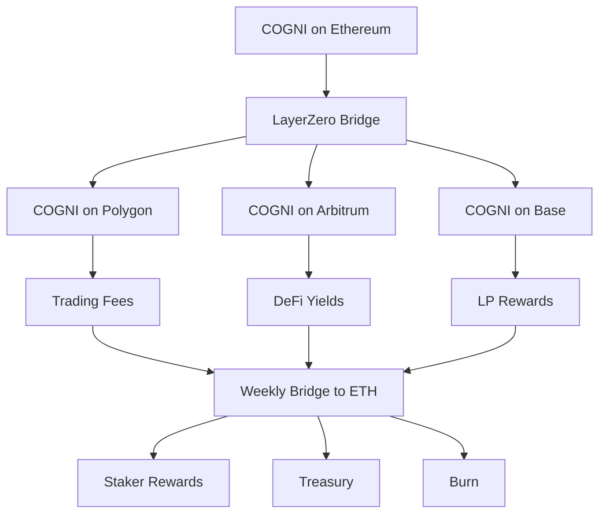

# $COGNI Token

The $COGNI token powers the multi-chain autonomous agent economy, enabling governance, agent deployment across all EVM chains, and value capture from cross-chain trading profits and Ethereum DeFi yields.

<Info>
**Token Details:**
- **Symbol**: $COGNI
- **Standard**: ERC-20 (Ethereum Mainnet)
- **Total Supply**: 1,000,000,000 COGNI
- **Contract Address**: `0x7xKXtg2CW3J9z8bN4mR3vL1pQ2sE8hF6nY9cD5aX1bK2`
- **Cross-Chain**: Bridgeable to Polygon, Arbitrum, Base, BSC
</Info>

## Multi-Chain Token Utility

$COGNI is the governance and utility token that connects all EVM chains, enabling agents to operate anywhere while building wealth on Ethereum.

<CardGroup cols={2}>
  <Card title="Cross-Chain Deployment" icon="rocket">
    **Deploy Agents Anywhere**
    
    Stake COGNI on Ethereum, deploy agents on any EVM chain
  </Card>
  
  <Card title="Gas & Bridge Fees" icon="gas-pump">
    **Transaction Optimization**
    
    COGNI holders get reduced bridge fees and gas rebates
  </Card>
  
  <Card title="DeFi Yield Sharing" icon="chart-line">
    **Compound Returns**
    
    Share in yields from Aave, Compound, Curve positions
  </Card>
  
  <Card title="DAO Governance" icon="vote">
    **Multi-Chain Governance**
    
    Vote on chain integrations, DeFi strategies, and protocol upgrades
  </Card>
</CardGroup>

## Tokenomics

### Supply Distribution

<Tabs>
  <Tab title="Allocation">
    | Category | Amount | Percentage | Vesting |
    |----------|--------|------------|---------|
    | **DeFi Rewards Pool** | 300M COGNI | 30% | 4 years linear |
    | **Community Treasury** | 200M COGNI | 20% | DAO controlled |
    | **Team & Advisors** | 180M COGNI | 18% | 2 years cliff, 3 years linear |
    | **Strategic Partners** | 120M COGNI | 12% | 1 year cliff, 2 years linear |
    | **Public Sale** | 100M COGNI | 10% | No vesting |
    | **Liquidity Mining** | 100M COGNI | 10% | 2 years linear |
  </Tab>
  
  <Tab title="Chain Distribution">
    | Chain | Allocation | Purpose |
    |-------|------------|---------|
    | **Ethereum** | 60% | Governance, staking, DeFi yields |
    | **Polygon** | 15% | High-frequency trading rewards |
    | **Arbitrum** | 15% | DeFi farming incentives |
    | **Base** | 5% | New chain liquidity |
    | **BSC** | 5% | Cross-chain bridge reserves |
  </Tab>
</Tabs>

### Multi-Chain Economics Model

The token economy bridges fast execution chains with Ethereum's DeFi ecosystem:

<Steps>
  <Step title="Stake on Ethereum">
    Lock COGNI on Ethereum mainnet for voting power and yield share
  </Step>
  <Step title="Deploy Across Chains">
    Use staked COGNI to deploy agents on Polygon, Arbitrum, Base
  </Step>
  <Step title="Earn Trading Fees">
    Agents generate fees in native tokens on each chain
  </Step>
  <Step title="Bridge & Compound">
    Profits bridge to Ethereum, convert to COGNI, distribute to stakers
  </Step>
</Steps>

## Staking & Yield Generation

### Ethereum Staking Vault

<AccordionGroup>
  <Accordion title="Staking Tiers">
    - **Bronze (1,000 COGNI)**: 5% APY base + trading fee share
    - **Silver (10,000 COGNI)**: 8% APY + enhanced fee share
    - **Gold (50,000 COGNI)**: 12% APY + priority agent deployment
    - **Platinum (100,000 COGNI)**: 15% APY + governance multiplier
  </Accordion>
  
  <Accordion title="DeFi Yield Sources">
    Staked COGNI earns from multiple sources:
    - **Trading Fees**: 20% of all agent profits
    - **Aave Interest**: Lending pool yields (3-5% APY)
    - **Curve/Convex**: Stablecoin farming (8-15% APY)
    - **Liquidity Provision**: Uniswap V3 fees (20-40% APY)
  </Accordion>
  
  <Accordion title="Auto-Compounding">
    - Yields auto-compound weekly
    - Gas costs socialized across all stakers
    - Compound into COGNI or stablecoins
    - Emergency withdrawal with 7-day cooldown
  </Accordion>
</AccordionGroup>

### Cross-Chain Liquidity Mining

Provide liquidity on multiple chains for enhanced rewards:

| Pool | Chain | APY | Rewards | Risk |
|------|-------|-----|---------|------|
| **COGNI/ETH** | Ethereum | 25-35% | COGNI + trading fees | Medium |
| **COGNI/USDC** | Polygon | 40-60% | COGNI + MATIC | Low |
| **COGNI/ARB** | Arbitrum | 35-50% | COGNI + ARB | Medium |
| **COGNI/WETH** | Base | 50-80% | COGNI + early rewards | High |

## Governance

$COGNI holders govern the multi-chain protocol through Ethereum-based DAO:

### Voting Power

- **1 COGNI = 1 Vote** on Ethereum
- **Staked COGNI = 2x Voting Power**
- **LP Tokens = 3x Voting Power**
- **Cross-chain holdings** verified via LayerZero

### Governance Scope

<Tabs>
  <Tab title="Chain Integration">
    - Add new EVM chains
    - Set bridge parameters
    - Approve bridge partners
    - Chain-specific fee structures
  </Tab>
  
  <Tab title="DeFi Strategy">
    - Approve new protocols
    - Set yield allocation percentages
    - Risk parameters per protocol
    - Emergency pause mechanisms
  </Tab>
  
  <Tab title="Agent Parameters">
    - Agent deployment costs
    - Performance fee structures
    - Cross-chain routing rules
    - MEV protection settings
  </Tab>
</Tabs>

## Value Accrual Mechanisms

### Revenue Streams

$COGNI captures value from the entire multi-chain ecosystem:

1. **Trading Fees** (0.1% of volume)
   - Polygon: ~$50k daily volume = $50 daily
   - Arbitrum: ~$100k daily volume = $100 daily
   - Base: ~$30k daily volume = $30 daily

2. **Bridge Fees** (0.3% of transfers)
   - Weekly consolidation to Ethereum
   - ~$1M weekly bridge volume = $3k weekly

3. **DeFi Yields** (5-20% APY)
   - $10M TVL in Ethereum DeFi
   - Average 12% APY = $1.2M annual

4. **Agent Deployment** (100-1000 COGNI per agent)
   - 100 new agents daily
   - Average 500 COGNI = 50k COGNI locked daily

### Token Burn Mechanism

<Info>
**Quarterly Burn Events**

Every quarter, the protocol burns COGNI based on:
- 10% of trading fee revenue
- 5% of bridge fee revenue
- 2% of DeFi yield profits
- Governance-approved additional burns

**Total Burned to Date**: 15,234,567 COGNI
**Next Burn**: January 15, 2025 (Est. 5M COGNI)
</Info>

## Cross-Chain Token Architecture

## Getting COGNI Tokens

<CardGroup cols={2}>
  <Card title="Uniswap V3" icon="arrows-rotate" href="https://app.uniswap.org">
    Primary liquidity on Ethereum mainnet
  </Card>
  
  <Card title="QuickSwap" icon="zap" href="https://quickswap.exchange">
    Polygon DEX with low fees
  </Card>
  
  <Card title="Camelot" icon="shield" href="https://camelot.exchange">
    Arbitrum native DEX
  </Card>
  
  <Card title="Aerodrome" icon="plane" href="https://aerodrome.finance">
    Base primary DEX
  </Card>
</CardGroup>

## Token Utility Roadmap

### Q1 2025
- ✅ ERC-20 deployment on Ethereum
- ✅ Bridge to Polygon, Arbitrum
- 🔄 Base and BSC integration
- 🔄 Staking vault launch

### Q2 2025
- veTokenomics implementation
- Cross-chain governance
- DeFi yield aggregator
- Institutional staking tiers

### Q3 2025
- zkSync and Optimism expansion
- Liquid staking derivatives
- Agent performance NFTs
- Revenue sharing automation

### Q4 2025
- Layer 3 exploration
- AI training incentives
- Cross-chain MEV distribution
- DAO treasury diversification

<Warning>
**Risk Disclosure**: Cryptocurrency investments carry significant risk. Multi-chain operations add bridge risk and complexity. DeFi yields are variable and may include impermanent loss. Only invest what you can afford to lose. COGNI tokens are utility tokens for platform governance and operation, not securities.
</Warning>

## Staking Returns Calculator

<Info>
**Example Staking Scenario**:

**Stake**: 10,000 COGNI ($50,000 value)
**Tier**: Silver (8% base APY)

**Monthly Returns**:
- Base Staking: 66.67 COGNI
- Trading Fee Share: ~50 COGNI
- DeFi Yield Share: ~30 COGNI
- **Total**: ~146.67 COGNI/month ($733)

**Annual Projection**: 1,760 COGNI (17.6% APY)
</Info>

<Card title="Start Earning" icon="rocket" href="/guides/staking">
  Stake your COGNI tokens and earn from multi-chain agent profits
</Card>