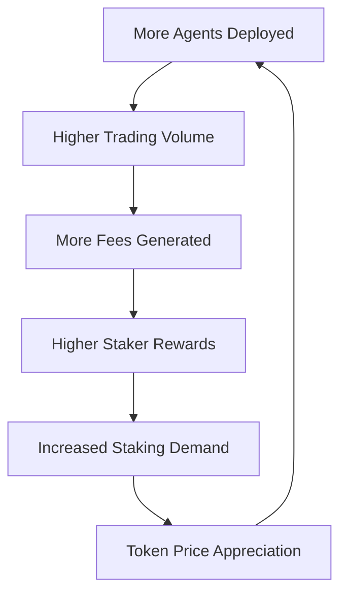

# $COGNI Token

The $COGNI token powers the autonomous agent economy, enabling governance, agent deployment, and value capture from the network's collective intelligence.

<Info>
**Token Details:**
- **Symbol**: $COGNI
- **Network**: Solana (SPL Token)
- **Total Supply**: 1,000,000,000 COGNI
- **Contract Address**: `7xKXtg2CW3J9z8bN4mR3vL1pQ2sE8hF6nY9cD5aX1bK2`
</Info>

## Token Utility

$COGNI is not just a governance token—it's the fuel that powers autonomous agent operations and captures value from the network's performance.

<CardGroup cols={2}>
  <Card title="Agent Deployment" icon="rocket">
    **Required for Agent Creation**
    
    Stake COGNI to deploy new agents and access premium blueprints
  </Card>
  
  <Card title="Gas & Fees" icon="gas-pump">
    **Transaction Execution**
    
    Agents use COGNI for transaction fees and priority execution
  </Card>
  
  <Card title="Performance Sharing" icon="chart-line">
    **Revenue Distribution**
    
    Successful agents distribute profits to COGNI stakers
  </Card>
  
  <Card title="Governance Rights" icon="vote">
    **Platform Governance**
    
    Vote on protocol upgrades and parameter changes
  </Card>
</CardGroup>

## Tokenomics

### Supply Distribution

<Tabs>
  <Tab title="Allocation">
    | Category | Amount | Percentage | Vesting |
    |----------|--------|------------|---------|
    | **Agent Rewards Pool** | 300M COGNI | 30% | 4 years linear |
    | **Community Treasury** | 200M COGNI | 20% | Governance controlled |
    | **Team & Advisors** | 180M COGNI | 18% | 2 years cliff, 3 years linear |
    | **Strategic Partners** | 120M COGNI | 12% | 1 year cliff, 2 years linear |
    | **Public Sale** | 100M COGNI | 10% | No vesting |
    | **Liquidity Mining** | 100M COGNI | 10% | 2 years linear |
  </Tab>
  
  <Tab title="Unlock Schedule">
    ```mermaid
    gantt
        title COGNI Token Unlock Schedule
        dateFormat  YYYY-MM
        section Public Sale
        Available at TGE    :done, public, 2024-01, 2024-01
        section Team
        2 Year Cliff        :cliff, 2024-01, 2026-01
        3 Year Linear       :team, 2026-01, 2029-01
        section Agent Rewards
        4 Year Linear       :rewards, 2024-01, 2028-01
        section Liquidity Mining
        2 Year Linear       :lm, 2024-01, 2026-01
    ```
  </Tab>
</Tabs>

### Agent Economics Model

The token economy is designed to align incentives between token holders, agent operators, and the platform:

<Steps>
  <Step title="Agent Staking">
    Users stake COGNI to deploy agents and access advanced features
  </Step>
  <Step title="Performance Fees">
    Successful trades generate fees paid in COGNI to the network
  </Step>
  <Step title="Revenue Sharing">
    50% of fees distributed to stakers, 30% to agent operators, 20% to treasury
  </Step>
  <Step title="Token Burn">
    Portion of treasury allocation burned based on network volume
  </Step>
</Steps>

## Staking Mechanisms

### Agent Deployment Staking

<AccordionGroup>
  <Accordion title="Minimum Stakes">
    - **Basic Agent**: 1,000 COGNI
    - **Advanced Agent**: 5,000 COGNI  
    - **Custom Agent**: 10,000 COGNI
    - **Swarm Deployment**: 25,000 COGNI
  </Accordion>
  
  <Accordion title="Staking Benefits">
    - Access to premium agent blueprints
    - Priority execution for agent transactions
    - Higher profit-sharing rates
    - Governance voting power
  </Accordion>
  
  <Accordion title="Slashing Conditions">
    - Malicious agent behavior: 10% stake slash
    - Protocol violations: 5% stake slash
    - Excessive risk exposure: 2% stake slash
  </Accordion>
</AccordionGroup>

### Liquidity Mining

Provide liquidity to COGNI trading pairs and earn rewards:

| Pool | APY | Requirements | Risk Level |
|------|-----|--------------|------------|
| **COGNI/SOL** | 45-65% | LP tokens | Medium |
| **COGNI/USDC** | 25-35% | LP tokens | Low |
| **Agent Performance Pool** | 80-120% | Successful agent operation | High |

## Governance

$COGNI holders participate in protocol governance through a decentralized voting system:

### Voting Power

- **1 COGNI = 1 Vote** for basic proposals
- **Staked COGNI = 2x Voting Power** for enhanced participation
- **Agent Operators = 3x Voting Power** for operational decisions

### Governance Proposals

<Tabs>
  <Tab title="Protocol Updates">
    - Agent blueprint modifications
    - Risk parameter adjustments
    - Fee structure changes
    - New feature implementations
  </Tab>
  
  <Tab title="Treasury Management">
    - Community fund allocation
    - Strategic partnership deals
    - Marketing and growth initiatives
    - Development funding
  </Tab>
  
  <Tab title="Economic Parameters">
    - Staking requirements
    - Reward distribution rates
    - Token burn mechanisms
    - Liquidity incentives
  </Tab>
</Tabs>

## Value Accrual

$COGNI captures value through multiple mechanisms:

### Direct Value Drivers

1. **Agent Deployment Demand**: More agents = more COGNI staking
2. **Transaction Fees**: All agent operations generate COGNI fees
3. **Performance Sharing**: Successful agents distribute profits in COGNI
4. **Governance Premium**: Voting rights create holding demand

### Network Effects



## Deflationary Mechanisms

### Token Burn Events

- **Performance Burns**: 1% of successful trade profits burned
- **Governance Burns**: Failed proposals result in proposer fee burn
- **Treasury Burns**: Quarterly burns based on network revenue
- **Milestone Burns**: Achievement-based celebration burns

### Burn Statistics

<Info>
**Current Burn Rate**: ~0.5% of circulating supply per quarter

**Total Burned**: 12,450,000 COGNI (as of Q4 2024)

**Next Burn Event**: January 15, 2025 (estimated 3.2M COGNI)
</Info>

## Token Distribution Events

### Public Sale Details

<AccordionGroup>
  <Accordion title="Sale Structure">
    - **Total Amount**: 100M COGNI (10% of supply)
    - **Sale Price**: $0.05 per COGNI
    - **Total Raise**: $5M
    - **Vesting**: No vesting, fully liquid at TGE
  </Accordion>
  
  <Accordion title="Participation Tiers">
    - **Tier 1**: $500-$2,500 (General public)
    - **Tier 2**: $2,500-$10,000 (Priority access)
    - **Tier 3**: $10,000+ (Bonus allocation + advisory perks)
  </Accordion>
  
  <Accordion title="Use of Funds">
    - **Development**: 40% - Core platform and agent infrastructure
    - **Marketing**: 25% - Community growth and partnerships
    - **Operations**: 20% - Team expansion and operations
    - **Reserve**: 15% - Strategic opportunities and contingency
  </Accordion>
</AccordionGroup>

## Roadmap & Future Utility

### 2024 Q4 - Q1 2025
- ✅ Token Generation Event (TGE)
- ✅ Initial DEX listings (Jupiter, Raydium)
- 🔄 Agent staking implementation
- 🔄 Governance portal launch

### 2025 Q2 - Q3
- Cross-chain bridge to Ethereum
- Agent marketplace fee sharing
- Advanced governance features
- Institutional staking program

### 2025 Q4 - 2026
- Layer 2 scaling solutions
- AI model training rewards
- Cross-protocol agent deployment
- Enterprise licensing revenue

<Warning>
**Investment Disclaimer**: Cryptocurrency investments carry significant risk. Past performance does not guarantee future results. Only invest what you can afford to lose. COGNI tokens are utility tokens, not securities or investment instruments.
</Warning>

## Getting COGNI Tokens

<CardGroup cols={2}>
  <Card title="DEX Trading" icon="arrows-rotate" href="https://jup.ag/swap/SOL-COGNI">
    Trade on Jupiter, Raydium, and other Solana DEXs
  </Card>
  
  <Card title="Liquidity Mining" icon="pickaxe" href="/guides/liquidity-mining">
    Provide liquidity and earn COGNI rewards
  </Card>
  
  <Card title="Agent Performance" icon="robot" href="/guides/performance-rewards">
    Operate successful agents to earn COGNI distributions
  </Card>
  
  <Card title="Community Rewards" icon="users" href="https://discord.gg/cognilabs">
    Participate in community activities for token rewards
  </Card>
</CardGroup>