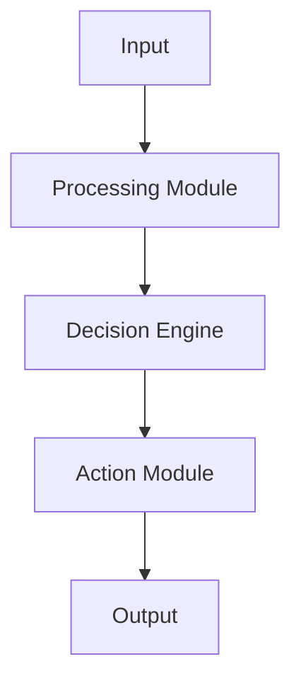

# Introduction

Provide an introduction to the research problem, motivation, and objectives.

## Background

Relevant background information and related work.

# Methodology

## Approach

Describe the methodology and approach used in the research.

## Experimental Setup

Detail the experimental setup, including:
- Hardware specifications
- Software environment
- Parameters used
- Evaluation metrics

### Agent Architecture



# Results

## Experimental Results

Present the main findings and results.

### Performance Metrics

| Metric | Value | Baseline | Improvement |
|--------|--------|----------|-------------|
| Accuracy | 95.2% | 87.1% | +8.1% |
| F1-Score | 0.94 | 0.85 | +0.09 |
| Latency | 12ms | 18ms | -6ms |

### Comparison with State-of-the-Art

Compare results with existing methods.

## Analysis

Analyze the results and discuss their implications.

# Discussion

## Findings

Discuss the key findings and their significance.

## Limitations

Acknowledge any limitations of the current work.

## Future Work

Suggest directions for future research.

# Conclusion

Summarize the main contributions and conclusions.

# References

1. Author, A. (2023). "Related Work Title." *Journal Name*, 10(2), 123-145.
2. Author, B. & Author, C. (2022). "Another Related Work." *Conference Proceedings*, pp. 456-789.
3. Author, D. (2024). "Recent Advances in AI Agents." *Preprint*, arXiv:2024.00001.

# Appendices

## Appendix A: Additional Experimental Data

Additional data, proofs, or supplementary information.

## Appendix B: Code Snippets

```python
def agent_function(input_data):
    """
    Example agent function implementation
    """
    processed_data = process(input_data)
    decision = make_decision(processed_data)
    return execute_action(decision)
```

## Appendix C: Reproducibility Information

- **Code Repository**: https://github.com/username/repo
- **Data Repository**: https://data.example.com/dataset
- **Environment**: Python 3.9, PyTorch 1.12
- **Random Seed**: 42
- **Hardware**: NVIDIA A100 GPU